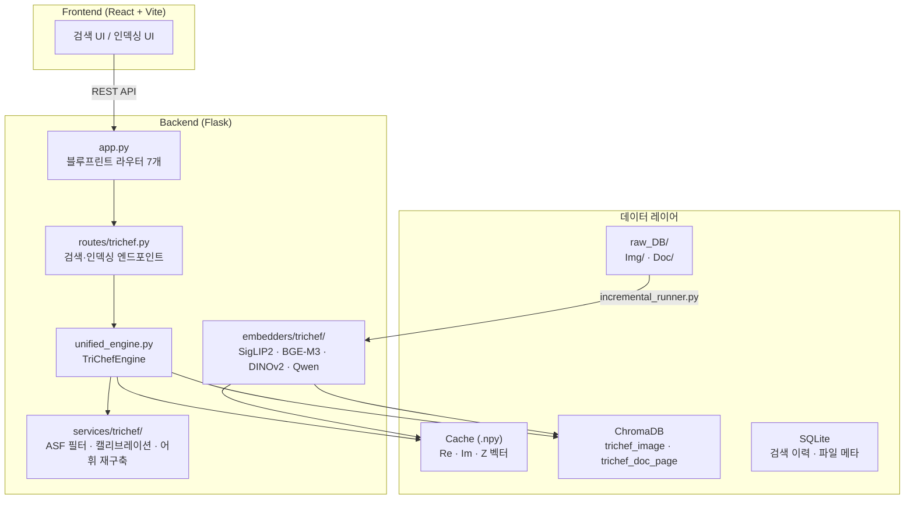
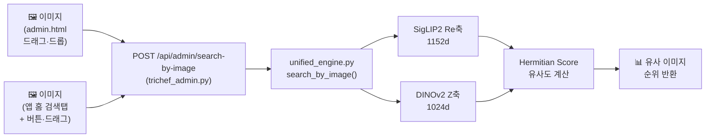

# DB Insight — 이미지 검색 파이프라인 구현 정리

---

## 시스템 아키텍처



**Blueprint 구성**

| 라우트 | 파일 | 역할 |
|---|---|---|
| `/api/trichef` | `routes/trichef.py` | TRI-CHEF 검색 · 인덱싱 핵심 |
| `/api/admin` | `routes/trichef_admin.py` | 이미지 검색 · 관리 |
| `/api/search` | `routes/search.py` | 기존 ChromaDB 검색 |
| `/api/index` | `routes/index.py` | 파일 인덱싱 작업 관리 |
| `/api/auth` | `routes/auth.py` | 인증 |
| `/api/files` | `routes/files.py` | 파일 관리 |
| `/api/history` | `routes/history.py` | 검색 이력 |

---

## 전체 파이프라인 개요

DB Insight의 이미지 도메인은 **인덱싱**과 **검색** 두 흐름으로 구성됩니다.

```
[ 인덱싱 흐름 ]
raw_DB/Img/ → Qwen 캡셔닝 → 3축 임베딩(Re·Im·Z) → Gram-Schmidt 직교화 → ChromaDB + .npy 캐시

[ 검색 흐름 ]
쿼리 이미지 → Re·Z축 임베딩 → Hermitian Score → 신뢰도 계산 → 결과 반환
```

**3축 벡터 구성**

| 축 | 모델 | 차원 | 역할 |
|---|---|---|---|
| Re | SigLIP2 | 1152d | 시각-언어 특징 |
| Im | BGE-M3 | 1024d | 텍스트 의미 (캡션 기반) |
| Z | DINOv2 | 1024d | 시각 디테일 |

---

## 1. 이미지 유사 검색 (Image-to-Image Search)

이미지를 드래그·드롭하거나 클릭해서 첨부하면 DB에서 유사한 이미지를 유사도 순으로 반환합니다.
**admin.html(관리자 도구)**과 **앱 홈 검색 탭(MainSearch)** 두 곳에서 모두 사용 가능합니다.



### 검색 엔진 — `unified_engine.py`

이미지 쿼리는 텍스트가 없으므로 Im축을 영벡터(1024d)로 처리하고, Re·Z 시각 축만으로 유사도를 계산합니다.

```python
# services/trichef/unified_engine.py — search_by_image() (Line 372~414)

def search_by_image(self, image_path: Path, domain: str = "image", topk: int = 20) -> list[TriChefResult]:
    """이미지 파일을 쿼리로 사용하는 유사 이미지 검색 (Image-to-Image)."""
    if domain not in self._cache:
        return []

    # 1. 쿼리 이미지에서 시각 벡터 추출
    # Re 축 (SigLIP2 1152d), Z 축 (DINOv2 1024d)
    from embedders.trichef import siglip2_re, dinov2_z
    q_Re = siglip2_re.embed_images([image_path])[0]   # (1152,)
    q_Z  = dinov2_z.embed_images([image_path])[0]     # (1024,)

    # 2. Im 축(의미)은 텍스트가 없으므로 0벡터 처리
    # Re(1152d)와 Z(1024d) 시각 특징 위주로 검색
    q_Im = np.zeros(1024, dtype=np.float32)

    # 3. 3축 Hermitian Score 로 유사도 계산
    d = self._cache[domain]
    dense_scores = tri_gs.hermitian_score(
        q_Re[None, :], q_Im[None, :], q_Z[None, :],
        d["Re"], d["Im"], d["Z"],
    )[0]
    combined_order = np.argsort(-dense_scores)

    # 4. 신뢰도 계산 및 결과 조립
    cal = calibration.get_thresholds(domain)
    abs_thr = cal.get("abs_threshold", 0.15)
    mu, sig = cal.get("mu_null", 0.0), max(cal.get("sigma_null", 1.0), 1e-9)

    out: list[TriChefResult] = []
    for i in combined_order[: topk * 3]:
        s = float(dense_scores[i])
        # 이미지 검색은 임계치를 조금 완화 (0.5배)
        if s < abs_thr * 0.5:
            continue
        z = (s - mu) / sig
        conf = 0.5 * (1 + math.erf(z / (2 ** 0.5)))
        meta = {"domain": domain, "dense": s, "is_image_query": True}
        out.append(TriChefResult(
            id=d["ids"][i], score=s, confidence=conf, metadata=meta,
        ))
        if len(out) >= topk:
            break
    return out
```

### API 엔드포인트 — `trichef_admin.py`

```python
# routes/trichef_admin.py — search_by_image() (Line 434~463)

@bp_admin.route("/search-by-image", methods=["POST"])
def search_by_image():
    """이미지 파일을 업로드하여 유사 이미지를 검색."""
    import tempfile
    if "image" not in request.files:
        return jsonify({"error": "이미지 파일이 없습니다."}), 400

    file = request.files["image"]
    domain = request.form.get("domain", "image")
    topk = int(request.form.get("topk", 20))

    # 임시 파일로 저장하여 엔진에 전달
    suffix = Path(file.filename).suffix if file.filename else ".jpg"
    with tempfile.NamedTemporaryFile(delete=False, suffix=suffix) as tmp:
        file.save(tmp.name)
        tmp_path = Path(tmp.name)

    try:
        results = _engine().search_by_image(tmp_path, domain=domain, topk=topk)
        out = []
        for r in results:
            out.append({
                "id": r.id,
                "score": round(r.score, 4),
                "confidence": round(r.confidence, 4),
                "metadata": r.metadata
            })
        return jsonify({"results": out})
    finally:
        tmp_path.unlink(missing_ok=True)   # 임시 파일 삭제
```

### 프론트엔드 ① — `admin.html` (관리자 도구)

드롭존에 이미지를 드래그·드롭하면 자동으로 검색이 실행됩니다.

```javascript
dropZone.addEventListener('drop', (e) => {
    e.preventDefault();
    const file = e.dataTransfer.files[0];

    const reader = new FileReader();
    reader.onload = (ev) => { previewImg.src = ev.target.result; };
    reader.readAsDataURL(file);

    const formData = new FormData();
    formData.append('image', file);
    formData.append('domain', 'image');
    formData.append('topk', '20');

    fetch('/api/admin/search-by-image', { method: 'POST', body: formData })
        .then(res => res.json())
        .then(data => renderResults(data.results));
});
```

### 프론트엔드 ② — `MainSearch.jsx` (앱 홈 검색 탭)

앱 홈 화면의 검색 탭에서 **`+` 버튼 클릭** 또는 **검색창에 이미지 드래그**로 이미지를 첨부하면 유사 이미지를 검색합니다. 결과는 기존 텍스트 검색과 동일한 카드 그리드로 표시됩니다.

**추가된 state / ref**

```jsx
// App/frontend/src/pages/MainSearch.jsx

const [imagePreview, setImagePreview] = useState(null)
const [dragOver, setDragOver]         = useState(false)
const fileInputRef = useRef(null)
```

**이미지 검색 함수**

```jsx
// App/frontend/src/pages/MainSearch.jsx — fetchImageResults / handleImageFile

const fetchImageResults = async (file) => {
  setSearching(true)
  setSearchError('')
  setResults([])
  const formData = new FormData()
  formData.append('image', file)
  formData.append('domain', 'image')
  formData.append('topk', '20')
  try {
    const r = await fetch(`${API_BASE}/api/admin/search-by-image`, { method: 'POST', body: formData })
    const j = await r.json()
    if (!r.ok) throw new Error(j.error || '이미지 검색 실패')
    // admin 응답을 ResultCard 형식으로 변환
    setResults(j.results.map(it => ({
      file_path: it.id,
      file_name: it.id.split('/').pop(),
      file_type: 'image',
      similarity: it.score,
      preview_url: `/api/admin/file?domain=image&id=${encodeURIComponent(it.id)}`,
      snippet: '',
    })))
  } catch (e) {
    setSearchError(e.message)
  } finally {
    setSearching(false)
  }
}

const handleImageFile = (file) => {
  if (!file || !file.type.startsWith('image/')) return
  setImagePreview(URL.createObjectURL(file))
  setQuery('이미지 검색')
  setInputValue('')
  setResultsReady(false)
  setView('results')
  window.history.pushState({ view: 'results' }, '')
  requestAnimationFrame(() => setResultsReady(true))
  fetchImageResults(file)
}
```

**홈 화면 검색 폼 — `+` 버튼 + 드래그 앤 드롭**

```jsx
// App/frontend/src/pages/MainSearch.jsx — home view 검색 폼

<form ref={formRef} onSubmit={handleSearch} className="w-full relative group"
  style={homeExiting ? { visibility: 'hidden' } : {}}
  onDragOver={(e) => { e.preventDefault(); setDragOver(true) }}
  onDragLeave={() => setDragOver(false)}
  onDrop={(e) => { e.preventDefault(); setDragOver(false); handleImageFile(e.dataTransfer.files[0]) }}>
  <div className={`glass-effect rounded-full p-2 flex items-center gap-4 shadow-[0_0_50px_rgba(133,173,255,0.1)] transition-all duration-300
    ${dragOver ? 'border border-primary/60 shadow-[0_0_30px_rgba(133,173,255,0.3)]' :
      listening ? 'border border-red-400/60 shadow-[0_0_30px_rgba(248,113,113,0.2)]' :
      'border border-outline-variant/20 hover:border-primary/40'}`}>

    {/* + 버튼 → 이미지 파일 선택 */}
    <button type="button"
      onClick={() => fileInputRef.current?.click()}
      className="w-12 h-12 rounded-full bg-gradient-to-r from-primary to-secondary flex items-center justify-center text-on-primary-fixed shadow-lg active:scale-90 transition-transform shrink-0"
      title="이미지로 검색">
      <span className="material-symbols-outlined font-bold">add_photo_alternate</span>
    </button>
    <input ref={fileInputRef} type="file" accept="image/*" className="hidden"
      onChange={(e) => handleImageFile(e.target.files[0])} />

    {/* 텍스트 입력창 */}
    <div className="flex-1 relative">
      <input
        type="text"
        value={listening ? '' : inputValue}
        onChange={(e) => !listening && setInputValue(e.target.value)}
        placeholder={listening ? '' : '로컬 파일에 대해 무엇이든 물어보세요...'}
        className="w-full bg-transparent border-none focus:ring-0 text-on-surface placeholder:text-on-surface-variant/40 font-manrope text-lg py-4 outline-none"
        readOnly={listening}
      />
      {listening && (
        <div className="absolute inset-0 flex items-center gap-3 py-4 pointer-events-none">
          <span className="text-red-400 font-manrope text-lg truncate">{interim || <span className="text-on-surface-variant/50">듣는 중...</span>}</span>
          <div className="flex items-center gap-[3px] shrink-0">
            {[0, 0.15, 0.3, 0.15, 0].map((delay, i) => (
              <div key={i} className="w-[3px] bg-red-400 rounded-full animate-bounce"
                style={{ height: `${[12,20,28,20,12][i]}px`, animationDelay: `${delay}s`, animationDuration: '0.8s' }} />
            ))}
          </div>
        </div>
      )}
    </div>

    {/* 마이크 버튼 */}
    <button type="button" onClick={toggleMic}
      className={`w-12 h-12 rounded-full flex items-center justify-center transition-all duration-200 shrink-0
        ${listening ? 'bg-red-500/20 text-red-400 animate-pulse' : 'text-on-surface-variant hover:text-primary hover:bg-primary/10'}`}>
      <span className="material-symbols-outlined" style={listening ? { fontVariationSettings: '"FILL" 1' } : {}}>mic</span>
    </button>
  </div>
</form>
```

**결과 화면 — 이미지 쿼리 썸네일 표시**

```jsx
// App/frontend/src/pages/MainSearch.jsx — results view 헤더

<div className="flex items-center gap-3">
  {imagePreview && (
    
  )}
  <h1 className="text-4xl font-extrabold tracking-tighter text-on-surface">{query}</h1>
</div>
```
