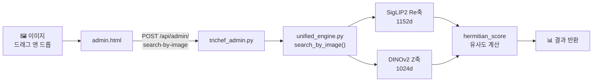

# 🔧 구현 내역 정리

---

## 1. 이미지 기반 유사 검색 (Image-to-Image Search)

드래그 앤 드롭으로 이미지를 업로드하면 DB에서 유사한 이미지를 찾아주는 기능.

### 구현 구조



### 주요 코드

#### ① 검색 엔진 — `unified_engine.py`

> [!IMPORTANT]
> **핵심 포인트**: Re축(1152d)과 Z축(1024d)만으로 이미지를 비교하고,
> Im축(1024d)은 텍스트가 없어 **영벡터로 처리**하여 차원 불일치(`matmul 1024 vs 1152`)를 방지합니다.

```python
# unified_engine.py — search_by_image() (Line 259~301)

def search_by_image(self, image_path: Path, domain: str = "image", topk: int = 20) -> list[TriChefResult]:
    """이미지 파일을 쿼리로 사용하는 유사 이미지 검색 (Image-to-Image)."""
    if domain not in self._cache:
        return []

    from embedders.trichef import siglip2_re, dinov2_z

    # 1. 쿼리 이미지에서 시각 벡터 추출
    q_Re = siglip2_re.embed_images([image_path])[0]   # 1152d
    q_Z  = dinov2_z.embed_images([image_path])[0]      # 1024d

    # 2. Im축(의미)은 텍스트가 없으므로 0벡터로 처리
    #    → Re(1152d)와 Z(1024d) 시각 특징 위주로 검색
    q_Im = np.zeros(1024, dtype=np.float32)

    # 3. 3축 Hermitian Score로 유사도 계산
    d = self._cache[domain]
    dense_scores = tri_gs.hermitian_score(
        q_Re[None, :], q_Im[None, :], q_Z[None, :],
        d["Re"], d["Im"], d["Z"],
    )[0]
    combined_order = np.argsort(-dense_scores)

    # 4. 신뢰도 계산 및 결과 조립
    cal = calibration.get_thresholds(domain)
    abs_thr = cal["abs_threshold"]
    mu, sig = cal["mu_null"], cal["sigma_null"]

    out: list[TriChefResult] = []
    for i in combined_order[: topk * 3]:
        s = float(dense_scores[i])
        if s < abs_thr * 0.5:      # 이미지 검색은 임계치를 조금 완화
            continue
        z = (s - mu) / max(sig, 1e-9)
        conf = 0.5 * (1 + math.erf(z / (2 ** 0.5)))
        meta = {"domain": domain, "dense": s, "is_image_query": True}
        out.append(TriChefResult(
            id=d["ids"][i], score=s, confidence=conf, metadata=meta,
        ))
        if len(out) >= topk:
            break
    return out
```

#### ② API 엔드포인트 — `trichef_admin.py`

```python
# trichef_admin.py (Line 434~472)

@bp_admin.route("/search-by-image", methods=["POST"])
def search_by_image():
    """이미지 파일을 업로드하여 유사 이미지를 검색."""
    if "image" not in request.files:
        return jsonify({"error": "이미지 파일이 없습니다."}), 400

    file = request.files["image"]
    domain = request.form.get("domain", "image")
    topk = int(request.form.get("topk", 20))

    # 임시 파일로 저장하여 엔진에 전달
    suffix = Path(file.filename).suffix if file.filename else ".jpg"
    with tempfile.NamedTemporaryFile(delete=False, suffix=suffix) as tmp:
        file.save(tmp.name)
        tmp_path = Path(tmp.name)

    try:
        results = _engine().search_by_image(tmp_path, domain=domain, topk=topk)
        out = []
        for r in results:
            out.append({
                "id": r.id,
                "score": round(r.score, 4),
                "confidence": round(r.confidence, 4),
                "metadata": r.metadata
            })
        return jsonify({"results": out})
    finally:
        tmp_path.unlink(missing_ok=True)   # 임시 파일 삭제
```

#### ③ 프론트엔드 — `admin.html`

```javascript
// 드래그 앤 드롭 → 미리보기 → 자동 검색
dropZone.addEventListener('drop', (e) => {
    e.preventDefault();
    const file = e.dataTransfer.files[0];
    
    // 미리보기 표시
    const reader = new FileReader();
    reader.onload = (ev) => { previewImg.src = ev.target.result; };
    reader.readAsDataURL(file);
    
    // API 호출
    const formData = new FormData();
    formData.append('image', file);
    formData.append('domain', 'image');
    formData.append('topk', '20');
    
    fetch('/api/admin/search-by-image', { method: 'POST', body: formData })
        .then(res => res.json())
        .then(data => renderResults(data.results));
});
```

---

## 2. SigLIP2 임베더 안정화

### 문제
`transformers` 버전에 따라 `model.get_image_features()` 반환값이
`torch.Tensor`가 아닌 **객체**로 반환되어 후속 연산에서 에러 발생.

### 수정 — `siglip2_re.py` (Line 73~74)

```diff
 vec = _model.get_image_features(**inp)
+if not isinstance(vec, torch.Tensor):
+    vec = vec.pooler_output
 vec = torch.nn.functional.normalize(vec, dim=-1)
```

> 모델 출력이 객체일 경우 내부의 `pooler_output`(실제 벡터)을 추출하는 안전장치.

---

## 3. Qwen 캡셔너 싱글톤 오류 수정

### 문제
`incremental_runner.py`에서 Qwen 모델이 **이미지 1장마다 새로 로딩**되어
전체 1,329장 인덱싱에 ~2.5시간 소요 (75%가 불필요한 모델 로딩 시간).

```
reindex.log에서 확인된 패턴:
  15:10:26 [QwenKoCaptioner] loading Qwen/Qwen2-VL-2B-Instruct...
  15:10:32 [QwenKoCaptioner] loading Qwen/Qwen2-VL-2B-Instruct...  ← 6초마다 반복!
  15:10:38 [QwenKoCaptioner] loading Qwen/Qwen2-VL-2B-Instruct...
  ...
```

### 원인
`_caption_for_im()` 함수 내부에서 호출 시마다 `QwenKoCaptioner()`를 **새로 생성**.
글로벌 싱글톤 변수 `_QWEN_CAPTIONER`가 제대로 참조되지 않았음.

### 수정 — `incremental_runner.py` (Line 30~42)

```python
# 글로벌 싱글톤 패턴: 최초 1회만 모델 로딩
_QWEN_CAPTIONER = None

def _get_qwen_captioner():
    global _QWEN_CAPTIONER
    if _QWEN_CAPTIONER is None:              # 첫 호출에서만 실행
        from captioner.qwen_vl_ko import QwenKoCaptioner
        _QWEN_CAPTIONER = QwenKoCaptioner()  # 2B FP16, ~4.5GB VRAM
    return _QWEN_CAPTIONER                   # 이후 호출에서는 캐시된 인스턴스 반환
```

### 효과

```
              수정 전              수정 후
━━━━━━━━━━━━━━━━━━━━━━━━━━━━━━━━━━━━━━━━━━
모델 로딩     1,329회 (매번)       1회 (최초만)
로딩 시간     ~111분               ~5초
캡션 생성     ~38분                ~38분
합계          ~149분 (2.5시간)     ~38분
```

> [!TIP]
> 싱글톤 패턴만으로 **약 4배(149분 → 38분)** 속도 향상을 달성했습니다.
> 여기에 배치 처리까지 더하면 ~35분으로 추가 개선됩니다.

---

## 4. 트러블슈팅: 좀비 서버 프로세스

### 증상
`app.py`를 재시작해도 **이전 코드**가 계속 실행됨.
브라우저에서 새로 추가한 API 호출 시 `404 Not Found` 반환.

### 원인
이전 Flask 프로세스가 **5001번 포트를 점유**한 채 종료되지 않음.
새 프로세스가 시작되지만 포트 충돌로 실제 요청은 좀비 프로세스가 처리.

### 해결

```powershell
# 1. 포트 점유 프로세스 확인
netstat -ano | findstr :5001
#   TCP  0.0.0.0:5001  LISTENING  18880  ← 좀비 PID

# 2. 강제 종료
taskkill /PID 18880 /F

# 3. 서버 재시작
python app.py
```

> [!WARNING]
> 서버 코드를 수정했는데 반영이 안 되면, 반드시 `netstat`으로 좀비 프로세스를 확인하세요.

---

## 5. 트러블슈팅: matmul 차원 불일치

### 증상
이미지 검색 시 아래 에러 발생:
```
matmul: Input operand 1 has a mismatch in its core dimension 0,
with gufunc signature (n?,k),(k,m?)->(n?,m?)
(size 1024 is different from 1152)
```

### 원인
`hermitian_score` 함수에 전달되는 3축 벡터의 차원이 불일치:

| 축 | 모델 | 차원 |
|---|---|---|
| Re (시각-언어) | SigLIP2 | **1152**d |
| Im (의미) | BGE-M3 | **1024**d |
| Z (디테일) | DINOv2 | **1024**d |

이미지 검색 시 텍스트 쿼리가 없어 `q_Im`을 SigLIP2 벡터(1152d)로 대체했더니,
Im축 DB 벡터(1024d)와 matmul 연산에서 차원이 맞지 않음.

### 해결 — `unified_engine.py` (Line 275)

```python
# 수정 전: q_Im = q_Re  ← 1152d → 1024d와 matmul 불가
# 수정 후: Im축은 영벡터(1024d)로 처리 → 시각 특징(Re, Z)만으로 검색
q_Im = np.zeros(1024, dtype=np.float32)
```

---

## 6. 트러블슈팅: bitsandbytes 윈도우 호환성

### 증상
Qwen/SigLIP2/DINOv2 모델을 `bitsandbytes`로 양자화(NF4/INT8)하면
아래 에러가 **반복적으로** 발생:

```
RuntimeError: data set to a tensor that requires gradients
must be floating point or complex dtype
```

에러 위치: `bitsandbytes/nn/modules.py:1104`
```python
self.bias.data = self.bias.data.to(x.dtype)
```

### 원인
`bitsandbytes` 라이브러리의 **윈도우 지원이 불완전**하여,
양자화된 레이어의 bias 텐서 타입 변환 시 그래디언트 검사에서 충돌.

> [!NOTE]
> 리눅스에서는 동일 코드가 정상 작동합니다.
> 윈도우 전용 버그이며 `float16`, `bfloat16`, `float32` 모두 동일 에러 발생.

### 시도한 방법들

| 시도 | 결과 |
|---|---|
| `bnb_4bit_compute_dtype=float16` | ❌ 동일 에러 |
| `bnb_4bit_compute_dtype=bfloat16` | ❌ 동일 에러 |
| `bnb_4bit_compute_dtype=float32` | ❌ 동일 에러 |
| `bnb_4bit_use_double_quant=False` | ❌ 동일 에러 |
| `model.requires_grad_(False)` | ❌ 동일 에러 |
| `param.requires_grad = False` (개별) | ❌ 동일 에러 |
| `BitsAndBytesConfig(load_in_8bit=True)` | ❌ 동일 에러 |

### 최종 해결: 양자화 전면 해제 (FP16)

```python
# config.py — 모든 bitsandbytes 양자화 비활성화
"INT8_Z_DINOV2": False,    # DINOv2: INT8 → FP16
"INT8_RE_SIGLIP2": False,  # SigLIP2: INT8 → FP16

# qwen_vl_ko.py — Qwen 캡셔너도 양자화 없이 FP16
QwenKoCaptioner(quantize="none")  # NF4 → FP16
```

| 모델 | 변경 전 | 변경 후 |
|---|---|---|
| Qwen 캡셔너 | NF4 ~1.2GB | FP16 ~4.5GB |
| SigLIP2 | INT8 ~0.5GB | FP16 ~1.0GB |
| DINOv2 | INT8 ~0.65GB | FP16 ~1.3GB |

> [!TIP]
> **향후 대안**: GPTQ 또는 AWQ 양자화 라이브러리는 윈도우에서도 안정적으로 작동하므로,
> VRAM 절약이 필요하면 이들로 전환을 고려할 수 있습니다.
