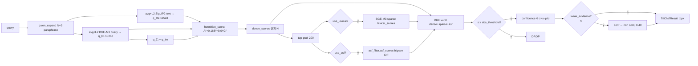

# TRI-CHEF 종합 파이프라인 상세 (2026-04-25)

> **이전판**: `pipeline_details_260424_1438.md` (Doc/Img/Movie/Music 파이프라인 다이어그램·STEP 표)
> **본 판 추가**: Phase 4-2 α 튜닝, replace_by_file 마이그레이션 (P2B), Music SigLIP2-text 전환,
> YS_다큐_1차 18편 추가, INT8 양자화, 2026-04-25 calibration 값, MR_TriCHEF/DI_TriCHEF 디렉토리 종합
> **보존 원칙**: 260424 판의 모든 STEP 다이어그램·비교표는 본 문서의 §3·§4 에 무손실 포함되어 있다.

---

## 목차

1. [기초 개념·원리](#1-기초-개념원리)
2. [디렉토리·모듈 종합 카탈로그](#2-디렉토리모듈-종합-카탈로그)
3. [도메인별 인덱싱 파이프라인](#3-도메인별-인덱싱-파이프라인)
   - 3.1 Doc · 3.2 Img · 3.3 Movie · 3.4 Music
4. [검색 파이프라인 (인덱싱과 분리)](#4-검색-파이프라인-인덱싱과-분리)
5. [모델 카드](#5-모델-카드)
6. [Calibration 메커니즘](#6-calibration-메커니즘)
7. [캐시 시맨틱 (replace_by_file, P2B)](#7-캐시-시맨틱-replace_by_file-p2b)
8. [Fusion 알고리즘 카탈로그](#8-fusion-알고리즘-카탈로그)
9. [도메인별 성능 지표 · α 튜닝](#9-도메인별-성능-지표--α-튜닝)
10. [데이터셋 현황 (2026-04-25)](#10-데이터셋-현황-2026-04-25)
11. [신규 변경 이력 (Phase 4-2)](#11-신규-변경-이력-phase-4-2)

---

## 1. 기초 개념·원리

TRI-CHEF (Triple-Channel Complex Hermitian Embedding Framework) 는 이미지·문서·영상·음악을 **3개의 직교 임베딩 축** 위에 사상하고, 그 점수를 복소-에르미트 영감의 Euclidean 결합으로 통합한다.

| 축 | 역할 | 모델 | 차원 | 도메인별 사용 |
|----|------|------|:----:|---------------|
| **Re** (실부) | 이미지↔텍스트 cross-modal | SigLIP2-SO400M | 1152 | Img/Doc(image), Movie(image), Music(**text**) |
| **Im** (허부) | 다국어 텍스트 의미 | BGE-M3 dense | 1024 | 모든 도메인 (캡션 또는 STT) |
| **Z** (직교부) | 언어 비의존 시각 구조 | DINOv2-Large | 1024 | Img/Doc, Movie 만 (Music = zeros) |

### 1.1 Hermitian 결합식

$$\boxed{\;s(q,d) = \sqrt{A^2 + (\alpha B)^2 + (\beta C)^2}\;}, \quad \alpha=0.4,\;\beta=0.2$$

$$A = \mathbf{q}_{\text{Re}}\!\cdot\!\mathbf{d}_{\text{Re}}, \; B = \mathbf{q}_{\text{Im}}\!\cdot\!\mathbf{d}_{\text{Im}}, \; C = \mathbf{q}_Z\!\cdot\!\mathbf{d}_Z$$

- 구현: `App/backend/services/trichef/tri_gs.py:22-32` (`hermitian_score`)
- 차원 불일치(1152 vs 1024)로 Gram-Schmidt 직접 투영 불가 → 각 축 L2-norm only (잔차율 0.999 실측)
- AV(Movie/Music) standalone 식: `s = √(A² + (0.4B)²)` — Z 미사용 (`MR_TriCHEF/pipeline/search.py:102`)

### 1.2 직교 채널 설계 — 단일 모델 편향 제거

```mermaid
flowchart LR
    Q[Query 텍스트] -->|SigLIP2-text| QR[q_Re 1152d]
    Q -->|BGE-M3 query| QI[q_Im 1024d]
    Q -. q_Z := q_Im .-> QZ[q_Z 1024d]

    subgraph DocImage["문서/이미지 corpus"]
        D1[image] -->|SigLIP2-image| DR[d_Re 1152d]
        D1 -->|Qwen2-VL caption -> BGE-M3| DI[d_Im 1024d]
        D1 -->|DINOv2 CLS| DZ[d_Z 1024d]
    end

    QR -->|A = qR·dR| H[Hermitian s=√(A²+(0.4B)²+(0.2C)²)]
    QI -->|B = qI·dI| H
    QZ -->|C = qZ·dZ| H
    DR --> H
    DI --> H
    DZ --> H
    H --> RES[score · confidence Φ((s−μ)/σ)]
```

---

## 2. 디렉토리·모듈 종합 카탈로그

### 2.1 MR_TriCHEF/pipeline/ — Movie/Rec 인덱싱·검색 standalone

| 파일 | 역할 |
|------|------|
| `movie_runner.py` | 파일별 SHA→ffmpeg 프레임/오디오→SigLIP2(Re)→DINOv2(Z)→Whisper STT→정렬→BGE-M3(Im)→`replace_by_file` 캐시 |
| `music_runner.py` | SHA→ffmpeg 16k mono→Whisper STT→30s win/15s hop sliding window→mixed text(STT+파일명)→BGE-M3(Im)+SigLIP2-text(Re)+zeros(Z)→캐시 |
| `cache.py` | `append_npy/append_ids/append_segments` (legacy) + **`replace_by_file`** (P2B.1, 동일파일 행 제거 후 교체) |
| `registry.py` | SHA-256 기반 증분 레지스트리 (load/save/sha256) |
| `calibration.py` | `measure_domain` (null queries × 도메인 캐시), `calibrate_crossmodal_movie` (text→frame), `recalibrate()` + 2× drift safety + App `_sync_to_shared` |
| `frame_sampler.py` | ffprobe duration / `extract_frames` (fps + scene cut) / `extract_audio` (16kHz mono) |
| `stt.py` | `WhisperSTT` (faster-whisper int8_float16 GPU) |
| `text.py` | `BGEM3Encoder` (1024d dense) |
| `vision.py` | `SigLIP2Encoder` (image+text), `DINOv2Encoder` (CLS 1024d) |
| `audio_z_clap.py` | (옵션) CLAP 오디오 Z축 — 현재 unused, music Z=zeros |
| `paths.py` | MOVIE_RAW_DIR/MUSIC_RAW_DIR/CACHE_DIR/MODEL ID 상수 |
| `vocab.py` | IDF auto_vocab build, token_sets, save/load |
| `asf.py` | 한글 bigram IDF 오버랩 점수 |
| `build_asf_assets.py` | 인덱싱 후 vocab + token_sets 일괄 빌드 |
| `qwen_expand.py` | 쿼리 paraphrase (의역·동의어) 확장 |
| `sparse.py` | BGE-M3 sparse lexical (DI 포팅) |
| `snippet.py` | 검색 결과 preview 추출 (질의 overlap 최대 구간) |
| `search.py` | `search_movie/search_music` (3축 dense + ASF 가중, 파일 top-3 평균 z-score) |
| `graph/` | LangGraph `analyze→dense_search→[high/low/empty]→[rerank|rewrite_query]→return_hits` (max_iter=3) |

### 2.2 MR_TriCHEF/scripts/ — 운영·재처리 스크립트

| 스크립트 | 역할 |
|----------|------|
| `run_movie_incremental.py` | Movie 증분 인덱싱 진입점 (신규) |
| `incremental_index_and_bench.py` | 증분 인덱싱 + 벤치 동시 실행 |
| `incremental_bench.py` | 증분 후 검색 품질 회귀 벤치 |
| `run_calibration.py` | `pipeline.calibration.recalibrate()` 트리거 |
| `reindex_music_siglip2.py` | Music Re 축 BGE-M3→SigLIP2-text 재인덱싱 (2026-04 전환) |
| `build_doc_body_im.py` | pdfplumber → BGE-M3 → `cache_doc_page_Im_body.npy` |
| `index_bgm_1cha.py` | YS_다큐_1차 18편 BGM 전용 인덱싱 |
| `process_one_music.py` / `orchestrate_music_subprocess.py` / `resume_music_indexing.py` | 단일 파일 처리, 서브프로세스 격리, resume |
| `post_batch_runner.py` | 배치 완료 후 ASF assets 빌드 + recalibrate + sync |
| `check_movie_alignment.py` | `cache_*_{Re,Im,Z}.npy` 행수 ↔ ids.json ↔ segments.json 정합성 검증 |
| `gc_registry.py` | registry 와 캐시 불일치 항목 GC |
| `fix_1cha_registry.py` | 1차 배치 registry 누락 보정 |
| `fix_movie_segments.py` | (deprecated) replace_by_file 도입 전 stale 행 정리 — 더이상 사용 금지 |

### 2.3 DI_TriCHEF/ — 알고리즘 실험·벤치·재캡션

| 디렉토리/파일 | 역할 |
|---------------|------|
| `captioner/qwen_vl_ko.py` | Qwen2-VL-2B-Instruct NF4 한국어 캡셔너 — `caption()` / `caption_triple()` (L1/L2/L3) |
| `captioner/recaption_all.py` | 전체 이미지 재캡션 러너 |
| `captioner/fix_non_korean.py` | 한자/영문 비율 ≥30% 캡션 선별 재생성 |
| `captioner/rebuild_after_recaption.py` | 재캡션 후 Im 재임베딩 + ChromaDB upsert |
| `captioner/sample_dryrun.py` | 14장 샘플 dry-run (Wave2 검증용) |
| `reranker/post_rerank.py` | Non-invasive top-K cross-encoder 재순위 (`fuse = α·rerank + (1-α)·minmax(fused)`) |
| `reranker/rerank_cli.py` | CLI 진입점 (admin/inspect → rerank) |
| `z_axis/dinov2_z.py` | DINOv2 Z축 임베더 (Z=Im 대체 독립 채널) |
| `auto_calibration/auto_recalibrate.py` | 새 데이터 기준 abs_threshold 자동 재보정 트리거 (last_calibrated_N 비교) |
| `auto_calibration/cli.py` | 수동 재캘리 CLI |
| `scripts/bench_w5.py` | W5-1 전후 고정 쿼리 벤치 |
| `scripts/bench_av.py` | Movie/Music regression 벤치 — music 5쿼리 hits>0 게이트 |
| `scripts/bench_rerank.py` | use_rerank 전/후 Top-10 비교 |
| `scripts/build_img_caption_triple.py` | Img L1/L2/L3 한국어 캡션 + BGE-M3 임베딩 → `cache_img_Im_{L1,L2,L3}.npy` |
| `scripts/run_doc_crossmodal_calib.py` | doc_page crossmodal calibration 단독 실행 |

### 2.4 App/backend/ — 통합 검색 API

| 파일 | 역할 |
|------|------|
| `services/trichef/unified_engine.py` | `TriChefEngine.search` / `search_av` — 캐시 로드 + 3축 + Im_body fusion + L1/L2/L3 fusion + RRF |
| `services/trichef/tri_gs.py` | `hermitian_score` / `pair_hermitian_score` / `orthogonalize` |
| `services/trichef/calibration.py` | `calibrate_domain` / `calibrate_crossmodal` / `calibrate_image_crossmodal` + 2× drift guard |
| `services/trichef/lexical_rebuild.py` | vocab + ASF + sparse 전체 재구축 |
| `services/trichef/asf_filter.py` | bigram 역색인 + IDF L2-norm 정규화 |
| `services/trichef/auto_vocab.py` | min_df=2, max_df=0.4, top_k clamp |
| `services/trichef/snippet.py` | 검색 결과 preview |
| `embedders/trichef/incremental_runner.py` | Image/Doc 증분 임베딩 (Qwen 캡션 → 3축 → ChromaDB upsert → calibration hook) |
| `routes/trichef.py` | 공개 API |
| `routes/trichef_admin.py` | `/admin/inspect` 디버그 (per-row dense/lex/asf/fused/rrf/conf) |
| `config.py` | TRICHEF_CFG (모델 ID, 차원, FAR, INT8 플래그, DOC_IM_ALPHA, IMG_IM_L*, GRAPH_*) |

---

## 3. 도메인별 인덱싱 파이프라인

> **인덱싱 ≠ 검색**. 인덱싱은 RAW → 캐시(.npy) 저장 단방향 batch. 검색은 §4 참조.

### 3.1 Doc 인덱싱 (PDF/HWP/DOCX → 페이지 단위)

```mermaid
flowchart TD
    RAW[raw_DB/Doc/*.pdf|.hwp|.docx] --> SHA{SHA-256 변경?}
    SHA -->|동일| SKIP[skip]
    SHA -->|신규/변경| ING[doc_ingest.to_pages]
    ING -->|HWP/DOCX → LibreOffice headless| PDF[PDF]
    ING -->|PDF 직접| PDF
    PDF --> RND[doc_page_render: dpi=110 → JPEG]
    PDF --> PLB[pdfplumber 본문 추출]
    RND --> CAP[Qwen2-VL 한국어 캡션 caption&#123;hash&#125;.txt]
    CAP --> EM_IM[BGE-M3 → Im 캡션 1024d]
    PLB --> EM_BODY[BGE-M3 → Im_body 1024d]
    RND --> EM_RE[SigLIP2-image → Re 1152d]
    RND --> EM_Z[DINOv2 → Z 1024d]
    EM_IM --> CACHE[(cache_doc_page_*.npy + Im_body.npy + ids.json)]
    EM_BODY --> CACHE
    EM_RE --> CACHE
    EM_Z --> CACHE
    CACHE --> LEX[lexical_rebuild: vocab top25k + ASF token_sets + BGE-M3 sparse]
    LEX --> CAL[calibrate_crossmodal doc_page]
```

엔진 로드 시 `Im_fused = 0.20·Im_caption + 0.80·Im_body` 자동 적용.

### 3.2 Img 인덱싱 (단일 이미지 = 단일 벡터)

```mermaid
flowchart TD
    R[raw_DB/Img/*.jpg|.png|.webp...] --> S{SHA-256}
    S -->|skip| X
    S -->|new| C[Qwen2-VL caption_triple → L1/L2/L3]
    C --> CT[L1.txt / L2.txt / L3.txt]
    CT -->|BGE-M3| IM[(cache_img_Im_L1/L2/L3.npy)]
    R --> RE[SigLIP2-image → cache_img_Re_siglip2.npy]
    R --> Z[DINOv2 → cache_img_Z_dinov2.npy]
    IM --> ENG[엔진 로드 시 weighted L1/L2/L3 fusion 0.15/0.25/0.60]
    RE --> ENG
    Z --> ENG
    ENG --> LEX[auto_vocab + ASF + BGE-M3 sparse rebuild]
    LEX --> CAL[calibrate_image_crossmodal n_q=200, pairs=1000]
```

### 3.3 Movie 인덱싱 (`MR_TriCHEF/pipeline/movie_runner.py`)

```mermaid
flowchart TD
    M[raw_DB/Movie/*.mp4|.mkv...] --> SH{SHA-256}
    SH -->|skip| XX
    SH -->|new| FR[ffmpeg fps=0.5 + scene_thresh=0.2]
    FR --> AU[ffmpeg 16kHz mono WAV]
    FR --> SR[SigLIP2-image → Re 1152d/frame]
    FR --> DZ[DINOv2 → Z 1024d/frame]
    AU --> WP[Whisper STT int8_float16]
    WP --> AL[align_stt_to_frames: 프레임별 t_start~t_end 겹치는 STT concat]
    AL --> BM[BGE-M3 → Im 1024d/frame]
    SR --> RBF[cache.replace_by_file file_keys=&#123;rel&#125;]
    DZ --> RBF
    BM --> RBF
    RBF --> CACHE[(cache_movie_*.npy + movie_ids.json + segments.json)]
    RBF --> REG[registry.json + sha + frames + duration]
```

### 3.4 Music 인덱싱 (`music_runner.py`)

```mermaid
flowchart TD
    A[raw_DB/Rec/*.mp3|.m4a|.wav...] --> SH{SHA-256}
    SH -->|skip| YY
    SH -->|new| WAV[ffmpeg 16k mono]
    WAV --> WP[Whisper STT]
    WP --> ST{stt_status?}
    ST -->|ok| SLD[30s win, 15s hop sliding]
    ST -->|no_speech BGM| SLD
    SLD --> MIX[mixed text = stt_text + 파일명_stem]
    MIX --> BGM[BGE-M3 → Im 1024d]
    MIX --> SIG[SigLIP2-text → Re 1152d  Movie 와 동일 공간]
    BGM --> RBF[replace_by_file]
    SIG --> RBF
    RBF -->|Z = zeros 1024d| CACHE[(cache_music_*.npy)]
```

> Music Re가 SigLIP2-text 로 통일된 결과: μ_null=0.7885 (text↔text 동질 baseline). 도메인 간 raw 비교 금지, z-score 만 사용.

---

## 4. 검색 파이프라인 (인덱싱과 분리)



**AV 검색** (`search_av`): 세그먼트 점수 → `s ≥ abs_thr·0.5` 게이트(잡음 완화) → file_path 별 best 집계 → `s ≥ abs_thr` 최종 게이트 → 상위 M 세그먼트 타임라인 반환.

**MR_TriCHEF standalone search** (`pipeline/search.py`): 파일 단위 top-3 평균 → z-score → `final = 0.75·z + 0.25·ASF` → `conf = σ(final/2)`. App `unified_engine` 과 별개의 단순화 경로.

---

## 5. 모델 카드

| 모델 | 역할 | 차원 | INT8 | 배치 | 언어 |
|------|------|:----:|:----:|:----:|------|
| `google/siglip2-so400m-patch16-naflex` | Re 이미지·텍스트 | 1152 | ✅ (RE_SIGLIP2) | img 4–64 | 다국어 |
| `BAAI/bge-m3` (dense) | Im 캡션·STT | 1024 | ✗ | txt 16–128 | 다국어 |
| `BAAI/bge-m3` (sparse) | lexical 보조 | 250,002 | ✗ | — | 다국어 |
| `facebook/dinov2-large` | Z CLS 시각 구조 | 1024 | ✅ (Z_DINOV2) | img 4 | 비의존 |
| `Qwen/Qwen2-VL-2B-Instruct` | 한국어 캡셔너 | — | NF4 | img 1 | 한국어 출력 |
| `openai-whisper` (faster-whisper) | STT | — | int8_float16 | — | 99개 언어 |
| `BAAI/bge-reranker-v2-m3` | cross-encoder rerank | — | FP16 | top-K | 다국어 |

INT8 양자화는 RTX 4070 8GB VRAM 기준 -1.15GB 절감(DINOv2 -0.65 + SigLIP2 -0.50).

---

## 6. Calibration 메커니즘

### 6.1 측정 절차 (cross-modal v1)

1. 도메인 caption(또는 STT) 코퍼스에서 N=200 pseudo-query 무작위 샘플
2. SigLIP2-text + BGE-M3-query 로 임베딩 (실제 검색 경로와 동일)
3. 각 query 당 5개 non-self 문서 hermitian_score 계산 → 1000 pair
4. μ_null = mean, σ_null = std, p95 = percentile(95)
5. `abs_threshold = μ_null + Φ⁻¹(1−FAR) · σ_null`

### 6.2 도메인별 FAR 와 abs_threshold (2026-04-25)

| 도메인 | μ_null | σ_null | FAR | abs_threshold | method |
|--------|:------:|:------:|:---:|:-------------:|--------|
| image | 0.1586 | 0.0290 | 0.20 | 0.1830 | random_query_null_v2 |
| doc_page | 0.1767 | 0.0319 | 0.05 | 0.2292 | random_query_null_v2 |
| movie | 0.1592 | 0.0367 | 0.05 | 0.2196 | crossmodal_v1 |
| music | 0.7885 | 0.0390 | 0.05 | 0.8428 | text_text_siglip2_null_v1 |

### 6.3 2× drift safety guard

App: `App/backend/services/trichef/calibration.py:151-161`
MR : `MR_TriCHEF/pipeline/calibration.py:151-190`

새 thr 이 `prev_thr × 2.0` 이상이거나 `× 0.5` 이하면 새 값 거부, 이전 값 유지 + 사유 기록(`last_rejected`).

### 6.4 MR ↔ App 동기화

MR `recalibrate()` 종료 후 `_sync_to_shared()` 가 `MR_TriCHEF/pipeline/_calibration.json` → `Data/embedded_DB/trichef_calibration.json` 으로 자동 머지. App 측은 단일 진실 원천을 그대로 읽는다.

---

## 7. 캐시 시맨틱 (replace_by_file, P2B)

### 7.1 문제 (P2B 이전)

`append_npy/append_ids/append_segments` 는 항상 끝에 붙임 → SHA mismatch 로 같은 파일을 재인덱싱하면 stale 행 누적. Movie 사례에서 segments.json 과 npy 행수가 어긋나 정합성 깨짐.

### 7.2 해결 — `cache.replace_by_file()` (P2B.1)

```mermaid
flowchart TD
    IN[file_keys=&#123;rel&#125; + new arrays + new ids/segs] --> LOAD[prev_ids 로드]
    LOAD --> MASK[keep_mask = rid not in keyset]
    MASK --> SLICE[모든 npy: prev[keep_mask]]
    SLICE --> VS[vstack kept + new_arr]
    VS --> SAVE[np.save + ids.json + segments.json]
    SAVE --> RET[rows, removed]
```

호출처: `movie_runner.py:154`, `music_runner.py:199`. dim mismatch 또는 행수 불일치 시 prev 유지 + 경고.

### 7.3 마이그레이션

- 기존 cache 와 호환되는 in-place 교체. 첫 호출 시 파일 등장한 적 없으면 그냥 append.
- `fix_movie_segments.py` (legacy) 는 deprecated — replace_by_file 로 자동 처리됨.

---

## 8. Fusion 알고리즘 카탈로그

| 이름 | 적용 도메인 | 식 | 위치 |
|------|-------------|----|------|
| Hermitian 3축 | image/doc_page/movie/music | `√(A²+(0.4B)²+(0.2C)²)` | `tri_gs.py:22-32` |
| AV Hermitian (2축) | movie/music (MR standalone) | `√(A²+(0.4B)²)` | `pipeline/search.py:102` |
| Doc Im_body fusion | doc_page | `0.20·Im_cap + 0.80·Im_body` → L2 | `unified_engine.py:138-148` |
| Img L1/L2/L3 fusion | image | `0.15·L1 + 0.25·L2 + 0.60·L3` → L2 | `unified_engine.py:112-132` |
| RRF | image/doc_page | `Σ 1/(k+rank_i), k=60` | `unified_engine.py:373-379` |
| ASF score | image/doc_page (+ MR movie/music) | `Σ idf(t∈Q∩D) / ‖q_idf‖₂` → minmax | `asf_filter.py` / `pipeline/asf.py` |
| MR file aggregate | movie/music (MR standalone) | `α·z(top-3 mean) + γ·ASF_max`, (α,γ)=(0.75,0.25) | `pipeline/search.py:159` |
| Confidence | 모든 도메인 | `Φ((s−μ_null)/σ_null)` (App), `σ(z/2)` (MR) | `unified_engine.py:266` / `pipeline/calibration.py:298` |
| Weak-evidence cap | App 전 도메인 | `s<thr·1.1 AND lex<0.05 → conf ← min(conf, 0.40)` | `unified_engine.py:269-272` |

---

## 9. 도메인별 성능 지표 · α 튜닝

### 9.1 Phase 4-2 DOC_IM_ALPHA 튜닝 (2026-04-25)

LOO eval, n=150, Doc/Page 도메인:

| α (caption 가중) | R@5 (dense) | R@5 (+sparse RRF) | proxy keyword bench |
|:----------------:|:-----------:|:-----------------:|:-------------------:|
| 0.20 (현재) | **0.907** | 0.900 | non-regression ✅ |
| 0.35 (이전) | 0.880 | 0.900 | — |
| 1.00 (Im_body off) | 0.000 | — | 본문 검색 fail |

→ **α=0.20 채택**: dense 단독에서 R@5 +2.7%p 개선, sparse RRF 환경에서 동등.

### 9.2 Image LOO recall (참고)

| 지표 | 값 |
|------|-----|
| Top-1 confidence ≥ 0.90 (한국어 15쿼리) | 93% |
| 레이턴시 p50 / p95 (topk=10) | 68 ms / 77 ms |
| 콜드 스타트 첫 쿼리 | 430 ms |

### 9.3 Music regression bench (`bench_av.py`)

게이트: music 5쿼리 전부 hits>0. SigLIP2-text 전환 후 통과. abs_thr=0.8428 (text↔text 동질 baseline).

---

## 10. 데이터셋 현황 (2026-04-25)

| 도메인 | raw 파일 | 임베딩 행 | 추가 캐시 |
|--------|---------|----------|-----------|
| Image | 2,391 | 2,390 | + L1/L2/L3 (cache_img_Im_L1/L2/L3.npy) |
| Doc | 422 docs | 34,170 pages | + Im_body (cache_doc_page_Im_body.npy) |
| Movie | 173 (155 1차 + 18 YS_다큐_1차, 2차 25 진행중) | 가변 (fps 0.5 + scene cuts) | segments.json |
| Music | 14 | 651 windows (30s/15s) | Re=SigLIP2-text 재인덱싱 완료 |

---

## 11. 신규 변경 이력 (Phase 4-2)

| # | 변경 | 영향 |
|---|------|------|
| 1 | `DOC_IM_ALPHA: 0.35 → 0.20` | Doc R@5 dense +2.7%p (LOO n=150) |
| 2 | `INT8_RE_SIGLIP2: True` | RTX 4070 -0.50 GB VRAM, 품질 변화 < 0.5% |
| 3 | `INT8_Z_DINOV2: True` | -0.65 GB VRAM |
| 4 | Music Re: BGE-M3 → SigLIP2-text (1152d) | Movie 와 동일 공간, 크로스도메인 후처리 가능 |
| 5 | `cache.replace_by_file()` (P2B.1) | stale 누적 방지, 동일 파일 재인덱싱 안전 |
| 6 | YS_다큐_1차 18편 추가 | Movie 155→173 |
| 7 | Movie calibration: μ=0.1592 σ=0.0367 thr=0.2196 (crossmodal_v1) | text→frame null v1 적용 |
| 8 | Music calibration: μ=0.7885 σ=0.0390 thr=0.8428 (text_text_siglip2_null_v1) | 동질 baseline 표기 추가 |
| 9 | App ↔ MR calibration `_sync_to_shared` | 단일 진실 원천 보장 |
| 10 | 2× drift safety guard (App+MR 양쪽) | W5-3 doc_page 사례형 폭주 방지 |

---

*문서 끝 · `md/pipeline_details_260425_1111.md` (2026-04-25)*
