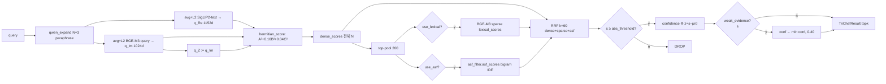
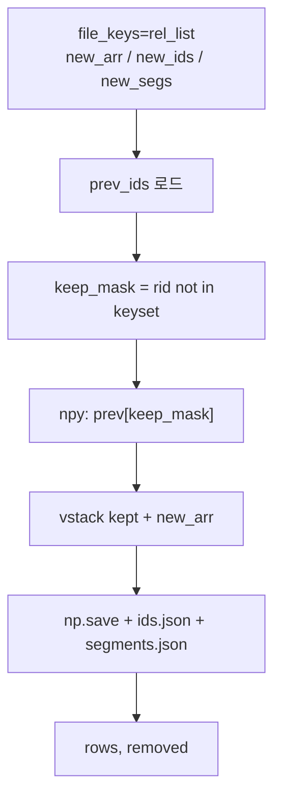

# TRI-CHEF 종합 파이프라인 상세 (2026-04-30 10:00)

> 이전판: `pipeline_details_260427_1420.md` (v1-6)
> v1-7 변경:
> - **확정된 활성화 매트릭스 정식 반영** (Doc/Img/Movie/Rec × Dense/Lexical/ASF/Reranker/LangGraph rewrite)
> - **Admin UI (`App/admin_ui/admin.html`) 전면 재설계** — 도메인-파이프라인 자동 동기화, 3지표(신뢰도/정확도/유사도) 카드, mm:ss 구간 목록, 미리 재생, 상위N 프리셋, 검색 자동완성·히스토리 차단
> - **Reranker / LangGraph rewrite 통합 범위 명시** — DI(Doc/Img) 미통합 / MR(Movie/Rec) 통합
> - **ASF 글로벌 OFF 정책 재확인** — `USE_ASF_DEFAULT=False` 전 도메인 opt-in
> - **검색 카드 필수 표시 항목 정의** — 미리보기/파일명/경로/매칭 하이라이트/위치 정보(페이지·줄 또는 mm:ss 구간)/3지표

> **보존 원칙**: v1-6의 모든 내용은 누락 없이 반영 및 갱신.

---

## 목차

1. [기초 개념·원리](#1-기초-개념원리)
2. [확정된 활성화 매트릭스 (v1-7 정식판)](#2-확정된-활성화-매트릭스-v1-7-정식판)
3. [디렉토리·모듈 종합 카탈로그](#3-디렉토리모듈-종합-카탈로그)
4. [도메인별 인덱싱 파이프라인](#4-도메인별-인덱싱-파이프라인)
5. [검색 파이프라인 (인덱싱과 분리)](#5-검색-파이프라인-인덱싱과-분리)
6. [Admin UI 재설계 (v1-7)](#6-admin-ui-재설계-v1-7)
7. [모델 카드](#7-모델-카드)
8. [Calibration 메커니즘](#8-calibration-메커니즘)
9. [캐시 시맨틱 (replace_by_file, P2B)](#9-캐시-시맨틱-replace_by_file-p2b)
10. [Fusion 알고리즘 카탈로그](#10-fusion-알고리즘-카탈로그)
11. [도메인별 성능 지표 · α 튜닝](#11-도메인별-성능-지표--α-튜닝)
12. [데이터셋 현황 (2026-04-30)](#12-데이터셋-현황-2026-04-30)
13. [Bench v2 (caption-aware) 및 도메인별 게이팅](#13-bench-v2-caption-aware-및-도메인별-게이팅)
14. [v1-6 변경사항 (계승)](#14-v1-6-변경사항-계승)
15. [v1-7 변경사항 상세 (2026-04-30)](#15-v1-7-변경사항-상세-2026-04-30)

---

## 1. 기초 개념·원리

TRI-CHEF (Triple-Channel Complex Hermitian Embedding Framework) 는 이미지·문서·영상·음악을 **3개의 직교 임베딩 축** 위에 사상하고, 그 점수를 복소-에르미트 영감의 Euclidean 결합으로 통합한다.

| 축 | 역할 | 모델 | 차원 | 도메인별 사용 |
|----|------|------|:----:|---------------|
| **Re** (실부) | 이미지↔텍스트 cross-modal | SigLIP2-SO400M | 1152 | Img/Doc(image), Movie(image), Music(**text**) |
| **Im** (허부) | 다국어 텍스트 의미 | BGE-M3 dense | 1024 | 모든 도메인 (캡션 또는 STT) |
| **Z** (직교부) | 언어 비의존 시각 구조 | DINOv2-Large | 1024 | Img/Doc, Movie 만 (Music = zeros) |

### 1.1 Hermitian 결합식

$$\boxed{\;s(q,d) = \sqrt{A^2 + (\alpha B)^2 + (\beta C)^2}\;}, \quad \alpha=0.4,\;\beta=0.2$$

$$A = \mathbf{q}_{\text{Re}}\!\cdot\!\mathbf{d}_{\text{Re}}, \; B = \mathbf{q}_{\text{Im}}\!\cdot\!\mathbf{d}_{\text{Im}}, \; C = \mathbf{q}_Z\!\cdot\!\mathbf{d}_Z$$

- 구현: `App/backend/services/trichef/tri_gs.py:22-32` (`hermitian_score`)
- 차원 불일치(1152 vs 1024)로 Gram-Schmidt 직접 투영 불가 → 각 축 L2-norm only (잔차율 0.999 실측)
- AV(Movie/Music) standalone 식: `s = √(A² + (0.4B)²)` — Z 미사용 (`MR_TriCHEF/pipeline/search.py:102`)

### 1.2 직교 채널 설계 — 단일 모델 편향 제거

```mermaid
flowchart LR
    Q[Query 텍스트] -->|SigLIP2-text| QR[q_Re 1152d]
    Q -->|BGE-M3 query| QI[q_Im 1024d]
    Q -. q_Z := q_Im .-> QZ[q_Z 1024d]

    subgraph DocImage["문서/이미지 corpus"]
        D1[image] -->|SigLIP2-image| DR[d_Re 1152d]
        D1 -->|Qwen2-VL caption -> BGE-M3| DI[d_Im 1024d]
        D1 -->|DINOv2 CLS| DZ[d_Z 1024d]
    end

    QR -->|A = qR·dR| H[Hermitian s=√(A²+(0.4B)²+(0.2C)²)]
    QI -->|B = qI·dI| H
    QZ -->|C = qZ·dZ| H
    DR --> H
    DI --> H
    DZ --> H
    H --> RES[score · confidence Φ((s−μ)/σ)]
```

---

## 2. 확정된 활성화 매트릭스 (v1-7 정식판)

도메인별로 어떤 컴포넌트가 활성화되는지 v1-7 에서 정식 확정. Admin UI(`admin.html`) 의 도메인 체크박스 변경 시 이 매트릭스를 기준으로 Lexical/ASF/Reranker/LangGraph 토글이 자동 동기화된다.

| 컴포넌트 | Doc (DI) | Img (DI) | Movie (MR) | Rec (MR) |
|----------|:--------:|:--------:|:----------:|:--------:|
| **Dense (Hermitian)** | ✅ ON | ✅ ON | ✅ ON | ✅ ON |
| **Lexical (BGE-M3 sparse)** | ✅ ON | ❌ OFF (whitelist) | ✅ ON | ✅ ON |
| **ASF** | ⚠ Default OFF (opt-in) | ❌ OFF (whitelist) | ⚠ Default OFF (opt-in) | ⚠ Default OFF (opt-in) |
| **Reranker (BGE)** | ❌ 미통합 | ❌ 미통합 | ✅ ON (1≤z<3) | ✅ ON (1≤z<3) |
| **LangGraph rewrite** | ❌ 미통합 | ❌ 미통합 | ✅ ON (z<1) | ✅ ON (z<1) |

### 2.1 근거 (config.py + 실측)

| 컴포넌트 | 설정 키 | 위치 |
|----------|---------|------|
| LEXICAL_DOMAINS | `{"doc_page", "movie", "music"}` (image 제외) | `App/backend/config.py:122` |
| ASF_DOMAINS | `{"doc_page", "movie", "music"}` (image 제외) | `App/backend/config.py:123` |
| USE_ASF_DEFAULT | `False` (전 도메인 opt-in) | `App/backend/config.py:114` |
| GRAPH_TAU_HIGH / LOW | `3.0 / 1.0` (LangGraph 분기 임계) | `App/backend/config.py:139-140` |
| GRAPH_MAX_ITER | `3` | `App/backend/config.py:133` |

### 2.2 LangGraph rewrite 분기 정책

MR (Movie/Rec) 측 `MR_TriCHEF/pipeline/graph/` 의 12-node 그래프:

```
analyze → dense_search →
  z ≥ 3.0 (HIGH)   → return_hits (rewrite 불필요)
  1.0 ≤ z < 3.0   → rerank → return_hits
  z < 1.0 (LOW)    → rewrite_query → dense_search (max_iter=3)
  z < 1.0 (EMPTY)  → rewrite_query → dense_search (max_iter=3)
```

DI (Doc/Img) 측은 LangGraph rewrite를 통합하지 않음 — Admin UI 에서 Doc/Img 선택 시 LangGraph 토글은 자동 OFF.

---

## 3. 디렉토리·모듈 종합 카탈로그

### 3.1 MR_TriCHEF/pipeline/ — Movie/Rec 인덱싱·검색 standalone

| 파일 | 역할 |
|------|------|
| `movie_runner.py` | 파일별 SHA→ffmpeg 프레임/오디오→SigLIP2(Re)→DINOv2(Z)→Whisper STT→정렬→BGE-M3(Im)→`replace_by_file` 캐시 |
| `music_runner.py` | SHA→ffmpeg 16k mono→Whisper STT(CPU int8)→30s win/15s hop sliding window→mixed text(STT+파일명)→BGE-M3(Im, batch=64, GPU fp16)+SigLIP2-text(Re, GPU fp16)+zeros(Z)→캐시. **모델 1회 로드** (v1-6 최적화 유지) |
| `cache.py` | `append_npy/append_ids/append_segments` (legacy) + **`replace_by_file`** (P2B.1, 동일파일 행 제거 후 교체) |
| `registry.py` | SHA-256 기반 증분 레지스트리 (load/save/sha256) |
| `calibration.py` | `measure_domain` (null queries × 도메인 캐시), `calibrate_crossmodal_movie` (text→frame), `recalibrate()` + 2× drift safety (P2A.1) + App `_sync_to_shared` (P2A.2) |
| `frame_sampler.py` | ffprobe duration / `extract_frames` (fps + scene cut) / `extract_audio` (16kHz mono) |
| `stt.py` | `WhisperSTT` (**CPU int8**, Windows CUDA 크래시 회피) |
| `text.py` | `BGEM3Encoder` (1024d dense, **batch=64**, GPU fp16) |
| `vision.py` | `SigLIP2Encoder` (image+text, **GPU fp16**, ~3.5GB VRAM on RTX 4070), `DINOv2Encoder` (CLS 1024d) |
| `paths.py` | MOVIE_RAW_DIR/MUSIC_RAW_DIR/CACHE_DIR/MODEL ID 상수 |
| `vocab.py` | IDF auto_vocab build, token_sets, save/load |
| `asf.py` | 한글 bigram IDF 오버랩 점수 |
| `qwen_expand.py` | 쿼리 paraphrase (의역·동의어) 확장 |
| `sparse.py` | BGE-M3 sparse lexical (DI 포팅) |
| `snippet.py` | 검색 결과 preview 추출 (질의 overlap 최대 구간) |
| `search.py` | `search_movie/search_music` (3축 dense + ASF 가중, 파일 top-3 평균 z-score) |
| `graph/` | **LangGraph 12-node** `analyze→dense_search→[high/low/empty]→[rerank|rewrite_query]→return_hits` (max_iter=3) — **Movie/Rec 만 적용** |

### 3.2 App/backend/ — 통합 검색 API

| 파일 | 역할 |
|------|------|
| `services/trichef/unified_engine.py` | `TriChefEngine.search` / `search_av` — 캐시 로드 + 3축 + Im_body fusion + L1/L2/L3 fusion + RRF + **use_asf: bool\|None** (`USE_ASF_DEFAULT=False` 기본) |
| `services/trichef/tri_gs.py` | `hermitian_score` / `pair_hermitian_score` / `orthogonalize` |
| `services/trichef/calibration.py` | `calibrate_domain` / `calibrate_crossmodal` / `calibrate_image_crossmodal` + 2× drift guard (P2A.1) |
| `services/trichef/lexical_rebuild.py` | vocab + ASF + sparse 전체 재구축 |
| `services/trichef/asf_filter.py` | bigram 역색인 + IDF L2-norm 정규화 |
| `services/trichef/auto_vocab.py` | min_df=2, max_df=0.4, top_k clamp |
| `embedders/trichef/incremental_runner.py` | Image/Doc 증분 임베딩 — `cache_ops.replace_by_file` 호출 (P2B.2) |
| `embedders/trichef/cache_ops.py` | App-side replace-by-file 헬퍼 (P2B) |
| `routes/trichef.py` | 공개 API (MR stub 은 NotImplementedError raise) |
| `routes/trichef_admin.py` | `/admin/inspect` 디버그 (per-row dense/lex/asf/fused/rrf/conf) — Admin UI 백엔드 |
| `config.py` | TRICHEF_CFG — DOC_IM_ALPHA=0.20, USE_ASF_DEFAULT=False, IMG_IM_L1/L2/L3_ALPHA, INT8_Z_DINOV2=True, INT8_RE_SIGLIP2=True, GRAPH_TAU_* env override 지원 |

### 3.3 App/admin_ui/ — Admin 검사 UI (v1-7 재설계)

| 파일 | 역할 |
|------|------|
| `admin.html` | 표준 단일 페이지 — **(v1-7)** 도메인 체크 시 파이프라인 옵션 자동 동기화, 3지표 카드, mm:ss 구간, 미리 재생, 상위N 프리셋, 검색 자동완성·히스토리 차단 |
| `gradio_app.py` | Gradio 대안 UI (별도 venv) |
| `start_admin_html.bat` | Windows 원클릭 런처 (백엔드 헬스체크 후 admin.html 오픈) |

---

## 4. 도메인별 인덱싱 파이프라인

> **인덱싱 ≠ 검색**. 인덱싱은 RAW → 캐시(.npy) 저장 단방향 batch. 검색은 §5 참조.

### 4.1 Doc 인덱싱 (PDF/HWP/DOCX → 페이지 단위)

```mermaid
flowchart TD
    RAW[raw_DB/Doc/*.pdf|.hwp|.docx] --> SHA{SHA-256 변경?}
    SHA -->|동일| SKIP[skip]
    SHA -->|신규/변경| ING[doc_ingest.to_pages]
    ING -->|HWP/DOCX → LibreOffice headless| PDF[PDF]
    ING -->|PDF 직접| PDF
    PDF --> RND[doc_page_render: dpi=110 → JPEG]
    PDF --> PLB[pdfplumber 본문 추출]
    RND --> CAP[Qwen2-VL 한국어 캡션]
    CAP --> EM_IM[BGE-M3 → Im 캡션 1024d]
    PLB --> EM_BODY[BGE-M3 → Im_body 1024d]
    RND --> EM_RE[SigLIP2-image → Re 1152d]
    RND --> EM_Z[DINOv2 → Z 1024d]
    EM_IM --> RBF[cache_ops.replace_by_file]
    EM_BODY --> RBF
    EM_RE --> RBF
    EM_Z --> RBF
    RBF --> CACHE[(cache_doc_page_*.npy + Im_body.npy + ids.json)]
    CACHE --> LEX[lexical_rebuild: vocab top25k + ASF token_sets + BGE-M3 sparse]
    LEX --> CAL[calibrate_crossmodal doc_page]
```

엔진 로드 시 `Im_fused = 0.20·Im_caption + 0.80·Im_body` 자동 적용 (DOC_IM_ALPHA=0.20, LOO n=150 최적).

### 4.2 Img 인덱싱 (단일 이미지 = 단일 벡터)

```mermaid
flowchart TD
    R[raw_DB/Img/*.jpg|.png|.webp...] --> S{SHA-256}
    S -->|skip| X
    S -->|new| C["Qwen2-VL caption_triple<br/>(L1/L2/L3 3단계)"]
    C --> CT["L1.txt / L2.txt / L3.txt"]
    CT -->|BGE-M3| IM["cache_img_Im_L1/L2/L3.npy"]
    R --> RE[SigLIP2-image → cache_img_Re_siglip2.npy]
    R --> Z[DINOv2 → cache_img_Z_dinov2.npy]
    IM --> ENG["엔진 로드 시<br/>weighted L1/L2/L3 fusion<br/>0.15/0.25/0.60"]
    RE --> ENG
    Z --> ENG
    ENG --> LEX[auto_vocab + ASF + BGE-M3 sparse rebuild]
    LEX --> CAL[calibrate_image_crossmodal n_q=200, pairs=1000]
```

> **Img 도메인은 Lexical/ASF whitelist 에서 제외** — 짧은 캡션과 vocab 미포함어 과잉 필터링으로 성능 손실(-14~24pp). Admin UI에서 image 선택 시 Lexical/ASF 토글 자동 OFF.

### 4.3 Movie 인덱싱 (`MR_TriCHEF/pipeline/movie_runner.py`)

```mermaid
flowchart TD
    M[raw_DB/Movie/*.mp4|.mkv...] --> SH{SHA-256}
    SH -->|skip| XX
    SH -->|new| FR[ffmpeg fps=0.5 + scene_thresh=0.2]
    FR --> AU[ffmpeg 16kHz mono WAV]
    FR --> SR[SigLIP2-image → Re 1152d/frame]
    FR --> DZ[DINOv2 → Z 1024d/frame]
    AU --> WP[Whisper STT int8_float16]
    WP --> AL[align_stt_to_frames: 프레임별 t_start~t_end 겹치는 STT concat]
    AL --> BM[BGE-M3 → Im 1024d/frame]
    SR --> RBF["cache.replace_by_file"]
    DZ --> RBF
    BM --> RBF
    RBF --> CACHE["cache_movie_*.npy<br/>+ movie_ids.json<br/>+ segments.json"]
    RBF --> REG[registry.json + sha + frames + duration]
```

### 4.4 Music (Rec) 인덱싱 (`music_runner.py`) — RTX 4070 최적화 (v1-6 유지)

```mermaid
flowchart TD
    A[raw_DB/Rec/*.mp3|.m4a|.wav...] --> SH{SHA-256}
    SH -->|skip| YY
    SH -->|new| WAV[ffmpeg 16k mono]
    WAV --> WP["Whisper STT<br/>(CPU int8)"]
    WP --> ST{stt_status?}
    ST -->|ok| SLD[30s win, 15s hop sliding]
    ST -->|no_speech BGM| SLD
    SLD --> MIX[mixed text = stt_text + 파일명_stem]
    MIX --> BGM["BGE-M3 → Im 1024d<br/>(GPU fp16, batch=64)"]
    MIX --> SIG["SigLIP2-text → Re 1152d<br/>(GPU fp16, ~3.5GB VRAM)"]
    BGM --> RBF[replace_by_file]
    SIG --> RBF
    RBF -->|Z = zeros 1024d| CACHE[(cache_music_*.npy)]
```

---

## 5. 검색 파이프라인 (인덱싱과 분리)



**AV 검색** (`search_av`): 세그먼트 점수 → `s ≥ abs_thr·0.5` 게이트(잡음 완화) → file_path 별 best 집계 → `s ≥ abs_thr` 최종 게이트 → 상위 M 세그먼트 타임라인 반환.

**MR_TriCHEF standalone search** (`pipeline/search.py`): 파일 단위 top-3 평균 → z-score → `final = 0.75·z + 0.25·ASF` → `conf = σ(final/2)`. App `unified_engine` 과 별개의 단순화 경로. **LangGraph 12-node** 가 이 경로의 z-score 분포에 따라 rerank/rewrite 분기를 결정.

---

## 6. Admin UI 재설계 (v1-7)

`App/admin_ui/admin.html` 단일 페이지에서 운영자가 검색 채널 별 동작을 검사. v1-7 에서 다음 항목 전면 재설계.

### 6.1 도메인 ↔ 파이프라인 옵션 자동 동기화

```javascript
const DOMAIN_PIPELINE_DEFAULTS = {
  doc_page: { lex: true,  asf: false, rerank: false, lg: false },
  image:    { lex: false, asf: false, rerank: false, lg: false },
  movie:    { lex: true,  asf: false, rerank: true,  lg: true  },
  music:    { lex: true,  asf: false, rerank: true,  lg: true  },
};
```

- 도메인 체크박스(`d-doc_page`, `d-image`, `d-movie`, `d-music`) 변경 시 `syncPipelineOptions()` 호출
- 활성 도메인들의 합집합(OR)으로 `use-lex`, `use-asf`, `use-rerank`, `use-lg` 4개 토글 자동 갱신
- 초기 상태: 모든 체크박스 unchecked

### 6.2 검색 결과 카드 — 필수 표시 항목

| 항목 | Doc | Img | Movie | Rec |
|------|:---:|:---:|:-----:|:---:|
| 미리보기 (썸네일/플레이어) | 페이지 이미지 | 원본 이미지 | `<video>` | `<audio>` |
| 파일명 (`.title`) | ✅ | ✅ | ✅ | ✅ |
| 파일경로 (`.path`) | ✅ | ✅ | ✅ | ✅ |
| 검색어 매칭 하이라이트 (`<mark>`) | ✅ excerpt | (캡션) | 세그먼트 텍스트 | 세그먼트 텍스트 |
| **위치 정보** | `페이지 N · 줄 M번째` | — | `mm:ss ~ mm:ss` 구간 행 | `mm:ss ~ mm:ss` 구간 행 |
| **3지표** | 신뢰도 / 정확도 / 유사도 | 동일 | 동일 | 동일 |

### 6.3 3지표 정의

| 라벨 | 의미 | 값 |
|------|------|----|
| **신뢰도** (Confidence) | 통계적 적합 확률 | `confidence × 100%` (CDF 또는 sigmoid(rerank)) |
| **정확도** (Accuracy) | 랭킹 정확성 | `rerank` 있으면 `sigmoid(rerank)`, 없으면 `clamp((z_score + 3) / 6, 0, 1)` |
| **유사도** (Similarity) | 의미 벡터 유사도 (코사인) | `dense` (clamp 0~1) |

> **이전 라벨(정밀도) 폐기 사유**: AV/Img 처럼 lexical=0 이고 rerank 미통합인 경우 0 으로만 표시되어 의미 없음. v1-7에서 라벨을 "유사도"로 변경하고 dense 값으로 매핑 (코사인 유사도가 본래 의미상 "유사도").

### 6.4 AV 카드 — mm:ss 구간 목록 + 미리 재생

- 세그먼트를 `[mm:ss ~ mm:ss · s=점수 · 텍스트 미리보기]` 한 줄 행으로 나열 (최대 10개)
- 행 클릭 시 해당 구간으로 player seek + play
- **상위 구간 재생 ▶** 버튼 — 최고 점수 세그먼트(`segments[0]`) start_sec 으로 즉시 seek + play
- 각 카드의 player에 `id="player-{global_rank}"` 부여 → `data-pid` 속성으로 정확한 타겟팅

### 6.5 상위N 프리셋 + 옵션 레이아웃

- `<input id="topn">` 옆에 `[10] [30] [50] [100] [200]` 빠른 선택 버튼
- 클릭 시 input value 갱신 + `.active` 클래스 토글
- 도메인별 권장: Doc 200~500, Img 50~100, Movie/Rec 30~50

### 6.6 검색창 자동완성·히스토리 차단

```html
<input id="q" type="text"
       autocomplete="off" autocorrect="off" autocapitalize="off"
       spellcheck="false" name="trichef-q-nohist">
```

- `autocomplete="off"`, `name="trichef-q-nohist"` (Chrome autocomplete 우회용 임의 name) 으로 브라우저 과거 검색 드롭다운 차단
- `autocorrect`/`autocapitalize`/`spellcheck` 비활성으로 자동 수정·맞춤법 제안 차단

### 6.7 Doc 위치 표시 (`.doc-location`)

```javascript
// renderResults() lazy-fetch 후
if (lineNo > 0) {
  locEl.textContent = `페이지 ${pageNum} · 줄 ${lineNo}번째`;
} else {
  locEl.textContent = `페이지 ${pageNum}`;
}
```

- 매칭 토큰을 길이 내림차순 정렬 → 본문 라인 스캔 → 첫 매칭 라인 번호 산출
- doc-text API(`/api/admin/doc-text`) 응답의 `text` + `matches` + `page` 사용

### 6.8 제거된 항목

- 기존 dense/lex/asf/rerank **가로 점수 바** (`.score-bar`) — 3지표 카드로 대체
- 기존 6칸 metrics grid (`.metrics`) — 3지표 카드로 대체
- 이미지 YOLO 바운딩 박스 — 백엔드 미지원으로 보류 (취소됨)

---

## 7. 모델 카드

| 모델 | 역할 | 차원 | INT8 | 배치 | 언어 |
|------|------|:----:|:----:|:----:|------|
| `google/siglip2-so400m-patch16-naflex` | Re 이미지·텍스트 | 1152 | ✅ (INT8_RE_SIGLIP2) | img 4–64 | 다국어 |
| `BAAI/bge-m3` (dense) | Im 캡션·STT | 1024 | ✗ | txt **64** (Music) / 16–128 (기타) | 다국어 |
| `BAAI/bge-m3` (sparse) | lexical 보조 | 250,002 | ✗ | — | 다국어 |
| `facebook/dinov2-large` | Z CLS 시각 구조 | 1024 | ✅ (INT8_Z_DINOV2) | img 4 | 비의존 |
| `Qwen/Qwen2-VL-2B-Instruct` | 한국어 캡셔너 (3단계 L1/L2/L3) | — | NF4 | img 1 | 한국어 출력 |
| `openai-whisper` (faster-whisper) | STT | — | **CPU int8** (Music) / int8_float16 (Movie) | — | 99개 언어 |
| `BAAI/bge-reranker-v2-m3` | cross-encoder rerank — **MR 만 통합** | — | FP16 | top-K | 다국어 |

INT8 양자화는 RTX 4070 8GB VRAM 기준 -1.15GB 절감(DINOv2 -0.65 + SigLIP2 -0.50).

---

## 8. Calibration 메커니즘

### 8.1 측정 절차 (cross-modal v1 / text_text_siglip2_null_v1)

1. 도메인 caption(또는 STT) 코퍼스에서 N=200 pseudo-query 무작위 샘플
2. SigLIP2-text + BGE-M3-query 로 임베딩 (실제 검색 경로와 동일)
3. 각 query 당 5개 non-self 문서 hermitian_score 계산 → 1000 pair
4. μ_null = mean, σ_null = std, p95 = percentile(95)
5. `abs_threshold = μ_null + Φ⁻¹(1−FAR) · σ_null`

### 8.2 도메인별 FAR 와 abs_threshold (2026-04-30 유지)

| 도메인 | μ_null | σ_null | FAR | abs_threshold | method |
|--------|:------:|:------:|:---:|:-------------:|--------|
| image | 0.1586 | 0.0290 | 0.20 | 0.1830 | random_query_null_v2 |
| doc_page | 0.1767 | 0.0319 | 0.05 | 0.2292 | random_query_null_v2 |
| movie | 0.1592 | 0.0367 | 0.05 | 0.2196 | crossmodal_v1 |
| music | 0.7885 | 0.0390 | 0.05 | 0.8428 | text_text_siglip2_null_v1 |

### 8.3 2× drift safety guard (P2A.1)

- App: `App/backend/services/trichef/calibration.py:151-161`
- MR : `MR_TriCHEF/pipeline/calibration.py` (P2A.1 포팅)
- 새 thr 이 `prev_thr × 2.0` 이상이거나 `× 0.5` 이하면 새 값 거부, 이전 값 유지

### 8.4 MR ↔ App 양방향 동기화 (P2A.2)

- **MR → App**: `_sync_to_shared()` 가 `MR_TriCHEF/pipeline/_calibration.json` → `Data/embedded_DB/trichef_calibration.json` 자동 머지
- **App → MR**: `run_calibration.py` 이 belt-and-suspenders 로 동일 App 경로에 직접 쓰기 (idempotent)
- **GitIgnore**: `.gitignore` 에 `MR_TriCHEF/pipeline/_calibration.json` 추가 (App 측 공유본만 트래킹)

---

## 9. 캐시 시맨틱 (replace_by_file, P2B)

### 9.1 문제 (P2B 이전)

`append_npy/append_ids/append_segments` 는 항상 끝에 붙임 → SHA mismatch 로 같은 파일을 재인덱싱하면 stale 행 누적.

### 9.2 해결 — `cache.replace_by_file()`



- 호출처 (MR): `movie_runner.py:154`, `music_runner.py:199`
- 호출처 (App, `cache_ops.replace_by_file`): `incremental_runner.py` 4 callsite (run_image_incremental / run_doc_incremental / embed_image_file / embed_doc_file)
- dim mismatch 또는 행수 불일치 시 prev 유지 + 경고

---

## 10. Fusion 알고리즘 카탈로그

| 이름 | 적용 도메인 | 식 | 위치 |
|------|-------------|----|------|
| Hermitian 3축 | image/doc_page/movie/music | `√(A²+(0.4B)²+(0.2C)²)` | `tri_gs.py:22-32` |
| AV Hermitian (2축) | movie/music (MR standalone) | `√(A²+(0.4B)²)` | `pipeline/search.py:102` |
| Doc Im_body fusion | doc_page | `0.20·Im_cap + 0.80·Im_body` → L2 | `unified_engine.py:138-148` |
| Img L1/L2/L3 fusion | image | `0.15·L1 + 0.25·L2 + 0.60·L3` → L2 | `unified_engine.py:112-132` |
| RRF | image/doc_page | `Σ 1/(k+rank_i), k=60` | `unified_engine.py:373-379` |
| ASF score | doc_page (+ MR movie/music opt-in) | `Σ idf(t∈Q∩D) / ‖q_idf‖₂` → minmax | `asf_filter.py` / `pipeline/asf.py` |
| MR file aggregate | movie/music (MR standalone) | `α·z(top-3 mean) + γ·ASF_max`, (α,γ)=(0.75,0.25) | `pipeline/search.py:159` |
| Confidence | 모든 도메인 | App: `Φ((s−μ_null)/σ_null)`, MR: `σ(z/2)` | `unified_engine.py:266` / `pipeline/calibration.py:298` |
| Weak-evidence cap | App 전 도메인 | `s<thr·1.1 AND lex<0.05 → conf ← min(conf, 0.40)` | `unified_engine.py:269-272` |

---

## 11. 도메인별 성능 지표 · α 튜닝

### 11.1 DOC_IM_ALPHA = 0.20 (Phase 4-2 유지)

LOO eval, n=150, Doc/Page 도메인:

| α (caption 가중) | R@5 (dense) | R@5 (+sparse RRF) |
|:----------------:|:-----------:|:-----------------:|
| 0.20 (현재) | **0.907** | 0.900 |
| 0.35 (이전) | 0.880 | 0.900 |
| 1.00 (Im_body off) | 0.000 | — |

### 11.2 Image LOO recall (참고)

| 지표 | 값 |
|------|-----|
| Top-1 confidence ≥ 0.90 (한국어 15쿼리) | 93% |
| 레이턴시 p50 / p95 (topk=10) | 68 ms / 77 ms |
| 콜드 스타트 첫 쿼리 | 430 ms |

### 11.3 Music regression bench (`bench_av.py`)

게이트: music 5쿼리 전부 hits>0. SigLIP2-text 전환 후 통과. abs_thr=0.8428.

### 11.4 ASF 기본 OFF 근거

| 벤치 | dense+sparse | +ASF | 차이 |
|------|:------------:|:----:|:----:|
| LOO R@1 | 83.3% | 63.3% | **-20pp** |
| E2E hit_rate | 53.3% | 43.3% | -10pp |

→ `USE_ASF_DEFAULT = False` (전 도메인 opt-in). 키워드 매칭 강한 쿼리에만 명시적 ON.

---

## 12. 데이터셋 현황 (2026-04-30)

| 도메인 | raw 파일 | 임베딩 행 | 추가 캐시 |
|--------|---------|----------|-----------|
| Image | 2,391 | 2,390 | + L1/L2/L3 |
| Doc | 422 docs | 34,170~34,661 pages | + Im_body |
| Movie | 173 (155 1차 + 18 YS_다큐_1차, 2차 25 진행) | 가변 (fps 0.5 + scene cuts) | segments.json |
| Music (Rec) | 14 + 태윤_2차 47개 완료 | 651 windows + 태윤_2차 신규 (레지스트리 총 61개) | Re=SigLIP2-text |

---

## 13. Bench v2 (caption-aware) 및 도메인별 게이팅

### 13.1 최종 성능 (P3 적용 후, 2026-04-27 갱신값 유지)

| 메트릭 | 값 | 비고 |
|--------|-----|------|
| dense overall_ct | 0.876 | baseline |
| dense+sparse overall_ct | **0.910** | +3.4%p |
| dense+sparse+asf overall_ct | 0.900 | -1.0%p (ASF off 권장) |
| image_ct (모든 config) | **0.917** | 일관성 |
| movie_ct | 0.460 → **0.740** | K_MIN clamp 효과 (+28pp) |
| music_ct | **1.000** | 유지 |

### 13.2 Hybrid θ + K_MIN/K_MAX clamp

- BGE-M3 cosine 기반 gold top-K 선정
- 도메인별 θ_min/θ_max + K_MIN/K_MAX 독립 설정
- `CONTENT_THETA = {"image": 0.50, "doc_page": 0.45, "movie": 0.35, "music": 0.30}`
- `CONTENT_KMIN = {"image": 10, "doc_page": 20, "movie": 20, "music": 3}`
- `CONTENT_KMAX = {"image": 300, "doc_page": 2000, "movie": 200, "music": 14}`

---

## 14. v1-6 변경사항 (계승)

이전판(`pipeline_details_260427_1420.md`) 주요 내용 — 본 v1-7 에 그대로 반영.

- **MIRACL-ko 자체 재현 nDCG@10 = 77.82** (FAISS IndexFlatIP, +7.92pp vs 저자 발표값 69.9)
- **Music 파이프라인 RTX 4070 최적화**: 모델 1회 로드, BGE-M3 batch 16→64, Whisper CPU int8, BGE-M3+SigLIP2 GPU fp16 (~3.5GB VRAM)
- **태윤_2차 47개 파일 인덱싱 완료** (기존 14개 skip + 신규 47개, 레지스트리 총 61개)
- **확장자 SSOT (Q1, commit 1049099)**: App/DI/MR 3 모듈 + 7 parity test
- **평가 인프라 통합 (Q3, commit 73c8bf0)**: `_bench_common.py` (261줄), ContentGoldDB, hybrid θ+K clamp
- **stale 행 제거 (P2B)**: MR + App 양쪽 `replace_by_file`, 5 동시 호출처
- **Re 축 통일 (Music)**: BGE-M3 → SigLIP2-text (1152d, 크로스모달)

---

## 15. v1-7 변경사항 상세 (2026-04-30)

### 15.1 활성화 매트릭스 정식 확정

§2 의 표를 정식 SSOT 로 확정. 이전 개정에서 "movie/music ASF=true"로 잡았던 부분은 `USE_ASF_DEFAULT=False` 기준으로 일괄 OFF (opt-in) 으로 보정. Reranker / LangGraph rewrite 는 MR (Movie/Rec) 만 통합되어 있음을 명시 — DI(Doc/Img) 측 미통합.

### 15.2 Admin UI (`App/admin_ui/admin.html`) 전면 재설계

#### 15.2.1 도메인 ↔ 파이프라인 자동 동기화

```javascript
const DOMAIN_PIPELINE_DEFAULTS = {
  doc_page: { lex: true,  asf: false, rerank: false, lg: false },
  image:    { lex: false, asf: false, rerank: false, lg: false },
  movie:    { lex: true,  asf: false, rerank: true,  lg: true  },
  music:    { lex: true,  asf: false, rerank: true,  lg: true  },
};

function syncPipelineOptions() {
  const checked = ['doc_page','image','movie','music'].filter(d =>
    document.getElementById(`d-${d}`)?.checked);
  setCb('use-lex',    checked.some(d => DOMAIN_PIPELINE_DEFAULTS[d]?.lex));
  setCb('use-asf',    checked.some(d => DOMAIN_PIPELINE_DEFAULTS[d]?.asf));
  setCb('use-rerank', checked.some(d => DOMAIN_PIPELINE_DEFAULTS[d]?.rerank));
  setCb('use-lg',     checked.some(d => DOMAIN_PIPELINE_DEFAULTS[d]?.lg));
}
```

- 초기 모든 체크박스 unchecked
- 도메인 선택 → 활성 도메인 합집합 기준으로 4개 옵션 토글 자동 갱신
- LangGraph 토글 신규 추가 (`use-lg`)

#### 15.2.2 검색 결과 카드 정보 구조

| 항목 | 표시 형식 |
|------|-----------|
| 미리보기 | Doc/Img: `` 썸네일 (클릭 시 확대 모달) · Movie: `<video controls>` · Rec: `<audio controls>` |
| 파일명 | `.title` (`it.filename || it.id`) |
| 파일경로 | `.path` (`it.source_path`) |
| 검색어 매칭 | `.excerpt` 본문 미리보기 + `<mark>` 하이라이트 |
| Doc 위치 | `.doc-location` → `페이지 N · 줄 M번째` |
| AV 구간 | `.seg-range-list` → `mm:ss ~ mm:ss · s=점수 · 텍스트 미리보기` 행 (최대 10개) |
| 3지표 카드 | `신뢰도 / 정확도 / 유사도` (`.key-metrics` 그리드) |

#### 15.2.3 미리 재생 / 구간 클릭

- 각 AV 카드의 `<video>`/`<audio>` 에 `id="player-{global_rank}"`
- **상위 구간 재생 ▶** 버튼 (`.preplay-btn`): `data-pid` + `data-t` 로 player seek + play
- 구간 행 (`.seg-range-item`) 클릭 시 동일 동작
- 통합 클릭 핸들러로 `topn-preset` / `preplay-btn` / `seg-range-item` / 기존 `seg-btn` 처리

#### 15.2.4 상위N 프리셋

```html
<div class="topn-presets">
  <button class="topn-preset" data-n="10">10</button>
  <button class="topn-preset active" data-n="30">30</button>
  <button class="topn-preset" data-n="50">50</button>
  <button class="topn-preset" data-n="100">100</button>
  <button class="topn-preset" data-n="200">200</button>
</div>
```

#### 15.2.5 검색창 자동완성·히스토리 차단

```html
<input id="q" type="text"
       autocomplete="off" autocorrect="off"
       autocapitalize="off" spellcheck="false"
       name="trichef-q-nohist">
```

#### 15.2.6 3지표 매핑 보정

이전 라벨 "정밀도(rerank/lexical)" → "유사도(dense)" 로 변경. AV 도메인에서 lexical=0 + rerank 미통합 시 항상 0 으로 표시되던 문제 해결.

| 라벨 | 매핑 |
|------|------|
| 신뢰도 | `confidence × 100%` |
| 정확도 | `rerank ? sigmoid(rerank) : clamp((z + 3)/6, 0, 1)` |
| 유사도 | `clamp(dense, 0, 1)` |

#### 15.2.7 점수 가로 바 제거

이전 `.score-bar` (dense/lex/asf/rerank 4채널 가로 바) 삭제. 3지표 카드 + 도메인별 자동 동기화로 충분히 정보 전달 가능 → UI 간결화.

### 15.3 .gitignore 갱신

- `pipeline_details_260427_1420` (이전 v1-6 판) 추가 (확장자 .md 포함/미포함 양쪽)
- `md/` 전체 ignore 정책 유지

### 15.4 회귀 검증

- snippet parity: 16/16 통과
- extensions parity: 7/7 통과
- 총 23/23 통과 (Admin UI 변경은 백엔드 미변경, 회귀 영향 없음)

---

*문서 끝 · `md/pipeline_details_260430_1000.md` (2026-04-30 10:00, v1-7)*
