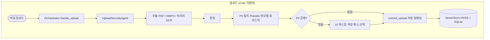
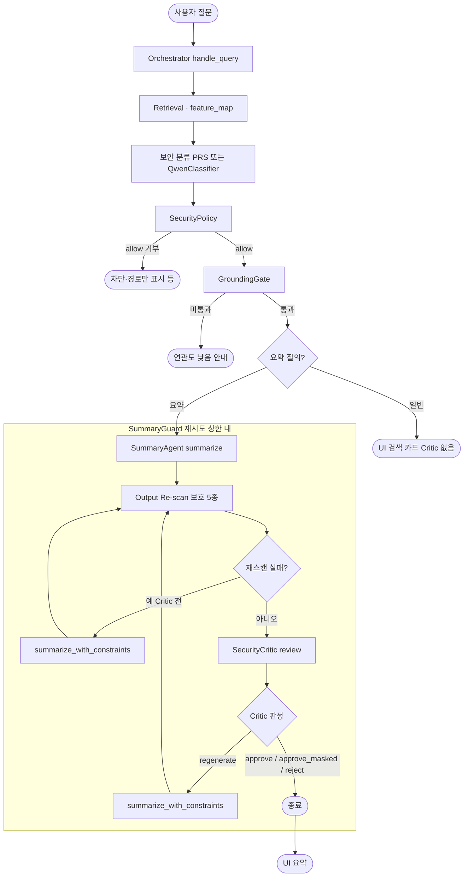

# 로컬 보안 RAG 시스템

개인 문서(PDF / HWPX / 이미지)를 업로드하고, 개인정보를 보호하면서 안전하게 검색할 수 있는 **로컬 전용** RAG 시스템입니다.

- **외부 클라우드 API는 사용하지 않습니다.** 임베딩·FAISS·OCR·UI는 모두 로컬에서 동작합니다.
- 질의 보안 분류는 기본적으로 **규칙·패턴 기반(PRS 등)** 이고, **`USE_QWEN=1`** 일 때만 Ollama의 Qwen 분류기를 추가로 사용합니다.
- 범용 **LLM 질의응답( ResponseAgent ) 경로는 제거**되었습니다. 자연어 **생성**은 **요약 질의**에서만 `SummaryAgent`가 담당합니다.

**역할 분리**

- **Summary Agent** — (요약 질의 시) 검색 청크를 바탕으로 요약문 **생성** 담당.
- **SummaryGuard + Security Critic** — 생성된 요약문에 대해 재탐지·정책·**최종 승인/거절/재생성** 담당. 요약은 이 경로를 통과해야 UI에 노출됩니다.

즉, **검색·분류·정책**과 **요약 생성·출력 심사**를 분리해 운영합니다.

---

## 아키텍처 개요

```
사용자
  │
  ▼
[Orchestrator]  ← 흐름 제어만 담당 (ABC 동시 소유 금지)
  │
  ├── [UploadSecurityAgent]     (권한 A: 신뢰불가 입력 처리)
  │     ├─ PDF / HWPX / 이미지(PNG/JPG/JPEG/HEIC/WEBP) 텍스트 추출
  │     ├─ 이미지: EasyOCR detail=1 → bbox 좌표 추출
  │     ├─ 이미지 영구 복사 (secure_store/images/)
  │     ├─ 청킹
  │     └─ PII 탐지 (Presidio + 한국형 Recognizer + 정책/휴리스틱; 업로드 단계에서 Qwen 미사용)
  │
  ├── [RetrievalAgent]          (권한 B: VectorDB 접근)
  │     ├─ FAISS 코사인 유사도 검색 (IndexFlatIP)
  │     └─ Feature Map 생성 (원문 미포함)
  │
  ├── [QwenClassifier]          (선택, USE_QWEN=1)
  │     └─ Feature Map 기반 NORMAL / SENSITIVE / DANGEROUS + (옵션) 쿼리 재작성
  │
  ├── [요약 경로만] SummaryAgent + SummaryGuard
  │     ├─ SummaryAgent: 요약·map-reduce·추출 폴백
  │     └─ SummaryGuard: 출력 재스캔 → SecurityCritic → regenerate 루프
  │
  └── [GroundingGate]
        └─ 근거 충분성 검증 (코사인 유사도 + 요약용 완화 규칙)
```

### 아키텍처 플로우 (Mermaid)

아래는 **코드 기준** 흐름입니다. 업로드 단에는 **Security Critic이 없고** `UploadSecurityAgent`만 사용합니다. 질의 단에서는 **`USE_QWEN=1` + `QUERY_REWRITE_ENABLED=1`** 일 때만 검색 직전에 Query Rewrite가 한 단계 더 붙습니다.

#### 업로드 보안 흐름



#### 질의·요약 흐름



---

## 핵심 흐름

### 일반 질의 (검색·카드만)

범용 답변 텍스트는 만들지 않습니다. **검색 결과 청크**가 UI 카드로 전달됩니다.

```
Query
→ Retrieval
→ (USE_QWEN 시) QwenClassifier · 아니면 PRS 규칙 분류
→ SecurityPolicy
→ GroundingGate
→ UI (소스 카드)
```

이 경로에는 **Security Critic이 없습니다.** Critic이 다루는 것은 주로 **LLM이 새로 생성한 요약문**이기 때문입니다.

### 요약 질의

```
Query
→ Retrieval
→ 분류 / 정책
→ GroundingGate
→ SummaryGuard
      → SummaryAgent (생성)
      → 요약문 PII 재스캔 (보호 유형만)
      → SecurityCritic (approve / approve_masked / reject / regenerate_with_constraints)
→ UI
```

### regenerate 경로

```
Summary 출력
→ Critic: regenerate_with_constraints
→ SummaryAgent 재생성 (제약 반영)
→ Critic 재심사 (SummaryGuard 내부 루프, 상한 있음)
→ UI
```

**요약**은 질문 키워드로 **선택 실행**되지만, 한 번 요약 경로에 들어가면 **SummaryGuard → Critic** 통과가 사실상 필수입니다.

---

## ABC 원칙 (핵심 보안 원칙)

에이전트는 아래 세 속성을 **동시에** 가질 수 없습니다.

| 속성 | 설명 |
| --- | --- |
| **A** | 신뢰할 수 없는 입력(파일, 질문) 처리 |
| **B** | 민감 시스템 / 개인 데이터 접근 |
| **C** | 외부 통신(Ollama 등) 또는 의미 있는 상태 변경 |

| 구성 요소 | A | B | C |
| --- | --- | --- | --- |
| UploadSecurityAgent | ✅ | ❌ | ❌ |
| RetrievalAgent | ❌ | ✅ | ❌ |
| QwenClassifier (`USE_QWEN=1`) | ✅(질의만) | ❌ | ✅(Ollama) |
| Summary Agent (`SUMMARY_USE_LLM=1`) | ❌ | ❌ | ✅(Ollama) |
| Security Critic | ❌ | ❌ | ❌(패턴·정책 기반 심사; 생성기 아님) |
| Orchestrator | 위임만 | 위임만 | 위임만 |

이 구조로 권한 충돌을 방지합니다.

---

## 단일 인덱스 아키텍처 (v2)

초기에는 마스킹 후 임베딩을 사용했지만 검색 품질이 크게 떨어졌습니다.

현재는 **원문 그대로 임베딩**하고, **UI 렌더링 시점에만** 마스킹·모자이크를 적용합니다.

```
업로드 시
  원문 텍스트
  → 파일명 + PII 유형 키워드 prefix 추가
  → FAISS 임베딩 저장
  PII 여부·유형은 SQLite 메타데이터 태그로만 기록

검색 시
  FAISS 코사인 유사도 검색
  → 원문(또는 메타) 반환

UI 카드에서
  display_masked=True 인 경우에만 시각적 마스킹 적용
```

---

## 폴더 구조

```
security/
├── main.py
├── config.py
├── requirements.txt
│
├── agents/
│   ├── orchestrator.py
│   ├── upload_security.py
│   ├── retrieval_agent.py
│   ├── response_agent.py          # 레거시 파일(범용 LLM 답변 경로 제거됨)
│   ├── summary/
│   │   └── summary_agent.py
│   └── security/
│       └── critic_domain.py      # Critic/세션 타입 re-export 등
│
├── security/
│   ├── security_critic.py
│   ├── summary_guard.py          # 요약 → 재스캔 → Critic → regenerate 도킹
│   ├── session_risk_engine.py
│   ├── critic_policy.py
│   ├── regenerate_handler.py
│   ├── qwen_classifier.py
│   ├── policy.py
│   ├── pii_detector.py
│   ├── pii_filter_helpers.py
│   ├── privacy_risk_score.py
│   ├── korean_recognizers.py
│   └── grounding_gate.py
│
├── harness/
│   ├── safe_tools.py             # ABC 하네스
│   └── safe_llm_call.py          # 요약 LLM 호출 타임아웃·retry 안정화
│
├── document/
│   ├── pdf_extractor.py
│   ├── hwpx_extractor.py
│   ├── image_extractor.py
│   └── chunker.py
│
├── vectordb/
│   └── store.py                  # FAISS + SQLite, search_within_doc, delete_documents 등
│
├── audit/
│   └── logger.py
│
├── ui/
│   └── gradio_app.py             # 감사 로그 / 임베딩 관리 탭 포함
│
├── secure_store/images/
└── tests/
```

---

## 설치 및 실행

### 1. 의존성 설치

```bash
cd security
pip install -r requirements.txt

pip install pillow-heif

python -m spacy download ko_core_news_sm
python -m spacy download en_core_news_sm
```

### 2. 실행

```bash
python main.py
```

브라우저: `http://localhost:7860`

기본값(`USE_QWEN=0`)으로도 동작합니다. 분류는 PRS·키워드 쪽으로 폴백합니다.

### 3. 선택: Qwen(Ollama) 사용

```bash
export USE_QWEN=1
ollama pull qwen2.5:3b   # config 기본 QWEN_MODEL과 맞추기
ollama serve
```

요약 LLM은 **`SUMMARY_USE_LLM`** 으로 별도 제어되며, Ollama가 없으면 **추출·규칙 기반 폴백**으로 동작합니다.

---

## 주요 환경변수

`config.py` 기준입니다. 일부는 `config.py`에만 있고 env로는 안 빠지는 항목도 있습니다.

| 변수 | 기본값(요약) | 설명 |
| --- | --- | --- |
| `USE_QWEN` | `0` | `1`이면 질의 분류 등에 Ollama Qwen 사용 |
| `SUMMARY_USE_LLM` | `1` | 요약 시 LLM 사용( Ollama 없으면 폴백 ) |
| `EMBEDDING_MODEL` | KR-SBERT 계열 | 로컬 임베딩 모델 id |
| `QWEN_MODEL` / `SUMMARY_MODEL` | `qwen2.5:3b` | 분류·요약 각각 기본 모델명 |
| `OLLAMA_URL` | `http://localhost:11434` | Ollama 주소 |
| `QWEN_TIMEOUT_SEC` | `15` | 분류 호출 타임아웃 |
| `SUMMARY_TIMEOUT_SEC` | `60` | 요약 호출 타임아웃 |
| `CHUNK_SIZE` | `800` | 청크 최대 길이 |
| `CHUNK_OVERLAP` | `100` | 청크 중복 |
| `TOP_K` | `5` | 일반 검색 Top-K |
| `SUMMARY_TOP_K` | `20` | 요약 검색 Top-K |
| `MAP_REDUCE_THRESHOLD` | `999` | 이 값 이상 청크면 map-reduce 비활성(사실상 off) |
| `MAP_REDUCE_GROUP_SIZE` | `3` | map-reduce 시 그룹 크기 |
| `GROUNDING_SIM_THRESHOLD` | `0.15` | 일반 질의 근거 임계값 |
| `GROUNDING_SIM_THRESHOLD_SUMMARY` | `0.07` | 요약 질의용 완화 임계값 |
| `GROUNDING_SIM_THRESHOLD_SENSITIVE` | `0.38` | SENSITIVE 라벨 시 완화 |
| `QUERY_REWRITE_ENABLED` | `0` | `USE_QWEN=1`일 때만 의미 있음 |
| `PIIDEBUG` | `0` | `1`이면 PII 탐지/탈락 디버그 로그 |
| `DEBUG_CONFIG` | `0` | `1`이면 기동 시 핵심 설정을 stderr에 출력 |

`ABC_ENFORCEMENT`는 `config.py`에서 `True` 고정입니다(`harness/safe_tools.py` 참고).

---

## 지원 파일 형식

| 형식 | 처리 방식 |
| --- | --- |
| PDF | PyMuPDF + 스캔 PDF 시 OCR 폴백 |
| HWPX | ZIP + XML 파싱 |
| PNG/JPG/JPEG | EasyOCR |
| HEIC | pillow-heif 변환 후 OCR |
| WEBP | PIL + OCR |

이미지는 카드에서 **원본 + PII 영역 모자이크**로 표시됩니다.

---

## 보호 대상 PII 정책

**탐지 가능**과 **정책상 보호(민감 처리)** 를 분리합니다. 상수는 `security/pii_filter_helpers.py` (`POLICY_PROTECTED_PII_TYPES` 등)를 기준으로 합니다.

### 보호 대상 (민감 처리·요약 재스캔·PRS·모달 등에 반영)

- 주민등록번호 (`KR_RRN`)
- 여권번호 (`KR_PASSPORT`)
- 운전면허번호 (`KR_DRIVER_LICENSE`)
- 계좌번호 (`KR_BANK_ACCOUNT`)
- 사업자등록번호 (`KR_BRN`)
- **신용·체크카드 (`CREDIT_CARD`)** — Luhn만으로 빠지는 목업·OCR 형태는 **보조 패턴**과 **카드 이미지 휴리스틱**으로 보강

### 보호 대상에서 제외 (브레이크 모달·요약 재스캔 대상 아님 등)

- 전화번호 (`KR_PHONE`, `PHONE_NUMBER`)
- 이메일 (`EMAIL_ADDRESS`)
- IBAN (`IBAN_CODE`)

전화·이메일·IBAN은 정책상 “민감 PII” 묶음에서 제외됩니다. **`CREDIT_CARD`는 보호 대상**입니다.

---

## 계좌번호 오탐 방지

`KR_BANK_ACCOUNT`는 숫자 패턴만으로 확정하지 않습니다.

- 은행명 또는 계좌 관련 **문맥**이 있을 것
- 동일 값 **반복**이 과도하면 표/푸터로 보고 제외
- 숫자만 있는 긴 문자열 등은 제외

---

## 업로드 흐름

```
파일 선택 → [임베딩 시작]
→ UploadSecurityAgent (추출·청킹·PII)
→ PII 없음: 자동 임베딩 완료
→ PII 있음: UI에서 마스킹 표시 / 그대로 저장 / 취소 선택
→ Orchestrator.commit_upload → VectorStore.add_chunks
```

---

## 검색 결과 보안 분류

| 질문 예시 | 레이블 | 동작(요약) |
| --- | --- | --- |
| 회의록 요약해줘 | NORMAL | 원문 카드 중심 |
| 내 계좌번호 보여줘 | SENSITIVE | 마스킹·확인 흐름 |
| 개인정보 전부 출력해 | DANGEROUS | 내용 차단, 파일명 수준만 |

---

## 검색 결과 카드

- 텍스트: `display_masked` 등에 따라 마스킹 렌더링
- 이미지: 원본 + bbox 모자이크
- 코사인 유사도를 관련도 힌트로 표시

---

## 요약 품질·보안 (최근 반영 요약)

- **`SUMMARY_TOP_K`** 로 일반 검색보다 넓게 가져온 뒤, 문서명 힌트·**`search_within_doc()`**·**`recent_upload_keys`(meta 영속)** 로 혼입을 줄입니다.
- 요약 청크는 **문서·페이지 순 재정렬**, 문서명이 있으면 **하드 필터** 우선(0건이면 자동 롤백).
- **`get_doc_pii_signal()`** 으로 문서 단위 PII 신호를 PRS·라벨 보정에 반영. `"전체"`는 유출 키워드가 없으면 bulk 오탐 완화.
- **GroundingGate**는 요약용 임계값·문서 토큰·단일 문서 fallback으로 과차단을 줄입니다.
- **`MAP_REDUCE_THRESHOLD`** 를 낮추면 청크 많을 때 map-reduce 분기(Gradio는 임계값 안내에 `6` 등을 참조할 수 있음). 기본 `999`는 사실상 비활성.
- **`harness/safe_llm_call.py`** 로 요약 LLM 호출의 타임아웃·retry·빈 응답 방지.
- 상세 도킹 설명: `SECURITY_CRITIC_SUMMARY_DOCKING_GUIDE.md`, 구현: `security/summary_guard.py`.

---

## 문서 혼입 방지

- `VectorStore.search_within_doc()` — 질문에 문서명이 잡히면 해당 문서 우선 검색.
- `recent_upload_keys` — `meta.db` `app_state`에 저장되어 **재시작 후에도** 유지.

---

## PDF 텍스트 정제

`pdf_extractor.py`에서 JS 문자열·HTML 조각·깨진 한글·비정상 라인 등을 **업로드 시점**에 제거합니다. 기존 인덱스에는 소급 적용되지 않으므로 필요 시 **재업로드**합니다.

---

## Session Risk Engine

`SummaryGuard` 경로에서 세션별 위험 점수를 누적해, **분할 요청**으로 우회하려는 패턴을 완화합니다. 구현: `security/session_risk_engine.py`.

---

## 감사 로그

SQLite(`audit/audit.db`)에 **업로드 이벤트**와 **질의 이벤트**(라벨, 차단, 검색 id 등)를 저장합니다. Gradio **감사 로그** 탭에서 확인합니다.

> Critic의 approve/reject 문자열 자체는 **별도 audit 테이블 스키마에 없을 수** 있으며, 운영 시에는 **`[OBS]` / `[SummaryGuard]`** 등 애플리케이션 로그로 추적하는 것이 빠릅니다.

---

## Gradio UI

- 검색·요약·소스 카드·감사 로그
- **임베딩 관리** 탭: 문서 단위 선택 삭제 후 인덱스 정리(`VectorStore.delete_documents`, UI에서 호출)

---

## 운영 시 주의사항

코드·`config` 변경 후에는 **앱 재시작**이 필요합니다.

```bash
cd security
python -c "import config; print(config.__file__)"
python -c "import config; print(config.SUMMARY_TOP_K, config.MAP_REDUCE_THRESHOLD, config.USE_QWEN, config.PIIDEBUG)"
```

---

## 권장 기본 설정 (CPU 환경)

```
QWEN_TIMEOUT_SEC=15
SUMMARY_TIMEOUT_SEC=60
SUMMARY_TOP_K=20
MAP_REDUCE_THRESHOLD=999
QUERY_REWRITE_ENABLED=0
PIIDEBUG=0
```

---

## FAISS 인덱스 재구축

인덱스 버전·메트릭 변경 시 앱이 재구축을 안내할 수 있습니다. 안내에 따라 문서를 다시 업로드하세요.

---

## 전체 흐름 (security 기준)

- **입구:** `ui/gradio_app.py` 또는 `main.py`
- **업로드:** `Orchestrator.handle_upload()` → `UploadSecurityAgent.scan_file()` → `commit_upload()` → `VectorStore.add_chunks()`
- **질의:** `Orchestrator.handle_query()` → 검색 → (옵션) Qwen 분류 → `SecurityPolicy` → `GroundingGate` → 요약이면 `SummaryGuard.summarize_secure()` → `QueryResponse`
- **후단:** 요약문에 대해서만 **SummaryGuard 내 SecurityCritic·regenerate** 루프
- **로그:** `audit/logger.py` + 콘솔 OBS 로그

---

## 어디부터 읽을지 (추천 순서)

1. `agents/orchestrator.py` — 전체 제어
2. `agents/upload_security.py` + `document/*`
3. `vectordb/store.py` + `agents/retrieval_agent.py`
4. `security/pii_detector.py` + `korean_recognizers.py` + `pii_filter_helpers.py`
5. `privacy_risk_score.py`, `policy.py`, `qwen_classifier.py`, `grounding_gate.py`
6. `security/summary_guard.py`, `security/security_critic.py`, `agents/summary/summary_agent.py`
7. `config.py`

---

## 공부 방법 (실전형)

1. 파일마다 “이 파일 책임 한 줄” 메모
2. `UploadScanResult`, `QueryResponse`, `feature_map` 입출력만 먼저 파악
3. `grounding_failed`, `policy_blocked`, timeout·폴백 분기부터 읽기
4. 환경변수 하나 바꿀 때 어떤 모듈이 달라지는지 매핑
5. 동일 질문으로 설정만 바꿔 실험 기록

---

## 병합·배포 전에 볼 포인트

- `Orchestrator`의 요약 진입 조건(`is_summary_request`)과 `SummaryGuard` 호출 순서
- `feature_map`에 **보호 PII**만 PRS에 반영되는지
- `search_within_doc` / recent fallback 우선순위
- EXE·패키징 시 `config`가 실제로 로드되는 경로
- `PIIDEBUG` / `DEBUG_CONFIG`로 재현 가능한지

---

## 관련 파일 빠른 참고

| 역할 | 경로 |
| --- | --- |
| 보호/무시 PII, 카드 휴리스틱 | `security/pii_filter_helpers.py` |
| 스캔 + 보조 카드 탐지 | `security/pii_detector.py` |
| 업로드 시 카드 이미지 보강 | `agents/upload_security.py` |
| 검색 feature_map·문서 PII 신호 | `vectordb/store.py` |
| 요약·map-reduce | `agents/summary/summary_agent.py` |
| 요약 3단 보호 | `security/summary_guard.py` |
| LLM 호출 안정화 | `harness/safe_llm_call.py` |
| Critic·정책 | `security/security_critic.py`, `critic_policy.py` |

원하면 다음에 **파일별 체크리스트(체크박스 형태)** 로만 따로 정리해 줄 수 있습니다.
